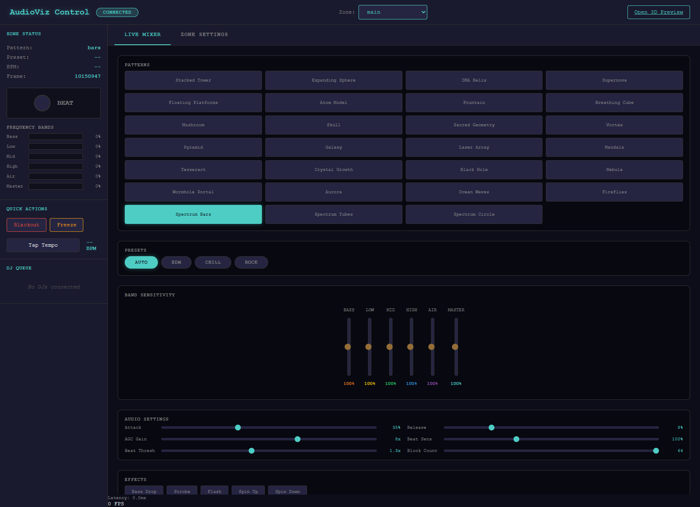
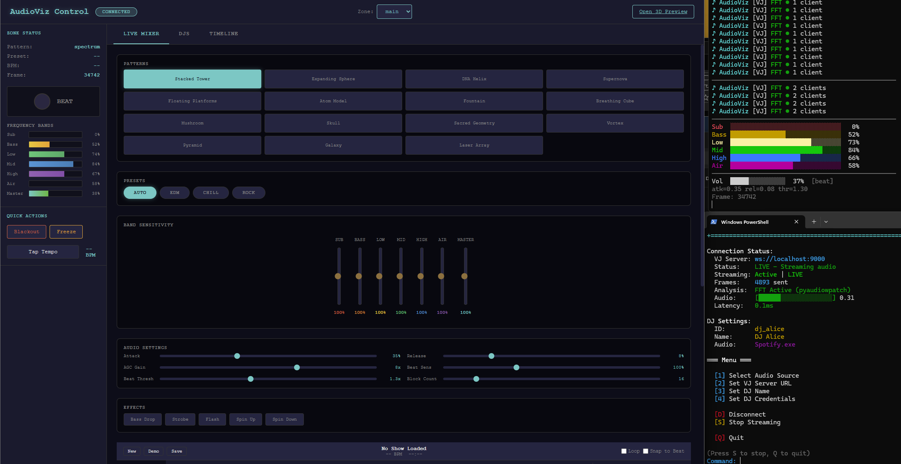

# Minecraft Audio Visualizer


A real-time audio visualization system that captures **Windows system audio** and drives reactive visuals in:

- **Minecraft** (Display Entities with performance batching)
- **Browser 3D Preview** (WebGL parity with Minecraft output)
- **Admin Control Panel** (DJ/VJ-style control surface for patterns, effects, zones)



---

## Why this exists

If you've ever wanted **festival-style visuals inside Minecraft**—driven by real music, controllable live like a VJ rig—this project provides the full pipeline:

1) capture audio from an app (Spotify/Chrome/etc)
2) analyze it in real time (FFT + beat-reactive hooks)
3) render synchronized visuals across Minecraft + web preview + admin UI

---

## Features

- **Real-time Audio Capture (Windows / WASAPI)** — capture audio from any Windows app
- **FFT Analysis** — real frequency-band processing with optional **ultra-low latency (~20ms)**
- **Multiple Visualization Patterns** — 15+ patterns (Spectrum Bars, DNA Helix, Atom Model, Galaxy, Sacred Geometry, etc.)
- **Browser Preview** — 3D WebGL preview with Minecraft parity
- **Admin Control Panel** — VJ-style control interface with debounced controls + effect triggers
- **Minecraft Integration** — Display Entities + batched updates for performance
- **Bedrock Mode** — particle-based visualization for Bedrock players via Geyser
- **Multi-DJ Support** — multiple remote DJs can perform with a central VJ controlling visuals
- **In-Game GUI** — menu system for zone management, DJ controls, and settings
- **Docker Support** — containerized VJ server for deployment
- **Secure Auth** — bcrypt password hashing for DJ authentication

---

## Screenshots & Demo

### Admin Control Panel
Latest MCAV control surface with live metrics, pattern switching, effects, and zone controls:


### 3D Browser Preview
Live preview scene during playback, matched to in-game rendering behavior:


### Multi-DJ Setup
Terminal spectrograph + admin panel running together during a live session:



**Demo Video:** [Watch on YouTube](https://www.youtube.com/watch?v=zH30YXrc2uw)

---

## Architecture

### Single DJ Mode (default)

```text
┌─────────────────┐     ┌──────────────────┐     ┌─────────────────┐
│  Audio Source   │────▶│  Audio Processor │────▶│   Minecraft      │
│ (Spotify/Chrome)│     │   (Python/FFT)   │     │    Plugin        │
└─────────────────┘     └────────┬─────────┘     └─────────────────┘
                                 │
                    ┌────────────┴────────────┐
                    ▼                         ▼
           ┌───────────────┐         ┌───────────────┐
           │ Browser 3D    │         │ Admin Panel   │
           │ Preview       │         │ Control UI    │
           └───────────────┘         └───────────────┘
```

### Multi-DJ Mode (live events)

```text
┌──────────────┐
│ DJ 1 (Remote)│───┐
│ --dj-relay   │   │
└──────────────┘   │    ┌────────────────┐     ┌─────────────────┐
                   ├───▶│    VJ Server    │────▶│    Minecraft     │
┌──────────────┐   │    │   (Central)     │     │    (Shared)      │
│ DJ 2 (Remote)│───┤    └───────┬────────┘     └─────────────────┘
│ --dj-relay   │   │            │
└──────────────┘   │    ┌───────┴────────┐
                   │    ▼                ▼
┌──────────────┐   │ ┌───────────┐ ┌───────────┐
│ DJ 3 (Remote)│───┘ │  Viewers   │ │  VJ Admin  │
│ --dj-relay   │     │ (Browser)  │ │   Panel    │
└──────────────┘     └───────────┘ └───────────┘
```

---

## Quick Start

### Requirements

- **Windows** (required for WASAPI audio capture)
- **Python 3.11+** (3.12/3.13 also supported)
- **Java 21+** (for the Minecraft plugin)
- **Paper/Spigot 1.21.1+** server

### Install

```bash
git clone https://github.com/ryanthemcpherson/minecraft-audio-viz.git
cd minecraft-audio-viz

# recommended
uv pip install -e .

# or
pip install -e .

# optional extras (FFT backends, beat detection, auth)
pip install -e ".[full]"
```

### Run (preview-first)

1) Start capture + web preview:

```bash
audioviz --app spotify --preview
```

2) Open:
- **3D Preview**: http://localhost:8080
- **Admin Panel**: http://localhost:8080/admin/

### Connect to Minecraft (optional)

1) Build the plugin:

```bash
cd minecraft_plugin && mvn package
```

2) Copy the jar from `target/` into your Paper server `plugins/` folder

3) Run the visualizer pointing at your server:

```bash
audioviz --app spotify --host your-mc-server
```

---

## Minecraft Commands

| Command | Description |
|---------|-------------|
| `/audioviz menu` | Open the main control panel (`/av menu`, `/mcav menu`) |
| `/audioviz zone create <name>` | Create a new visualization zone |
| `/audioviz zone delete <name>` | Delete a zone |
| `/audioviz zone list` | List all zones |
| `/audioviz zone setsize <name> <x> <y> <z>` | Set zone dimensions |
| `/audioviz zone setrotation <name> <degrees>` | Set zone rotation |
| `/audioviz zone info <name>` | Show zone details |
| `/audioviz pool init <zone> [count] [material]` | Initialize display-entity pool |
| `/audioviz pool cleanup <zone>` | Remove zone entities |
| `/audioviz test <zone> <wave|pulse|random>` | Run test animation |
| `/audioviz status` | Show plugin status |
| `/audioviz help` | Show command help |

---

## CLI Examples

```bash
# Local DJ mode
audioviz --app spotify                    # capture Spotify
audioviz --app chrome --preview           # capture Chrome + web preview
audioviz --host 192.168.1.100             # send to remote Minecraft server
audioviz --low-latency                    # ultra-low latency (~20ms)
audioviz --test                           # run without Minecraft

# VJ server (multi-DJ)
audioviz-vj                               # start VJ server
audioviz-vj --port 9000                   # custom DJ port

# Utilities
audioviz --list-apps                      # list capturable applications
audioviz --list-devices                   # list audio devices
```

### Options

```text
--app NAME          Application to capture audio from (default: spotify)
--host HOST         Minecraft server host (default: localhost)
--port PORT         Minecraft WebSocket port (default: 8765)

--preview           Enable browser preview server
--preview-port      WebSocket port for browser (default: 8766)
--http-port         HTTP port for web interface (default: 8080)

--low-latency       Enable ultra-low latency mode (~20ms)
--no-minecraft      Run without Minecraft connection
--no-fft            Disable FFT analysis (use synthetic bands)

--entities N        Number of visualization entities (default: 16)
--zone NAME         Visualization zone name (default: main)
```

---

## Visualization Patterns

| Pattern | Description |
|---------|-------------|
| Spectrum Bars | Classic frequency bar display |
| Stacked Tower | Vertical stacking bars |
| DNA Helix | Double helix rotating structure |
| Atom Model | Orbital electron visualization |
| Expanding Sphere | Pulsing sphere that expands with bass |
| Floating Platforms | Suspended platforms responding to audio |
| Fountain | Particle fountain effect |
| Breathing Cube | Cube that expands/contracts with music |
| Mushroom | Organic mushroom-shaped visualization |
| Skull | Beat-reactive skull pattern |
| Sacred Geometry | Mathematical sacred geometry patterns |
| Vortex | Spinning vortex tunnel |
| Pyramid | Egyptian pyramid with audio response |
| Galaxy | Spiral galaxy visualization |
| Laser Array | Concert-style laser beam array |
| Supernova | Explosive supernova effect |

---

## Multi-DJ Mode (Live Events)

Use Multi-DJ mode when multiple DJs are performing remotely and one VJ controls visuals.

### 1) Start the VJ Server (central control)

```bash
python -m audio_processor.vj_server --no-minecraft
```

Defaults:
- DJ connection port: `ws://localhost:9000`
- Browser preview: `http://localhost:8080`
- Admin panel: `http://localhost:8080/admin/`

### 2) DJs connect in relay mode (each DJ machine)

```bash
python -m audio_processor.app_capture --dj-relay \
  --vj-server ws://VJ_SERVER_IP:9000 \
  --dj-name "DJ Alice" \
  --dj-id "dj_alice" \
  --dj-key "alice123"
```

### 3) Optional: DJ authentication (recommended)

Generate bcrypt hashes:

```bash
python -m audio_processor.auth hash "mysecretpassword"
python -m audio_processor.auth init configs/dj_auth.json
```

`configs/dj_auth.json` is intentionally gitignored. Start from `configs/dj_auth.example.json` and keep real keys local.

Example `configs/dj_auth.json`:

```json
{
  "djs": {
    "dj_alice": {"name": "DJ Alice", "key_hash": "bcrypt:$2b$12$...", "priority": 1},
    "dj_bob": {"name": "DJ Bob", "key_hash": "bcrypt:$2b$12$...", "priority": 2}
  }
}
```

For production, run the VJ server with `--require-auth`.

---

## Minecraft Plugin Features

### GUI menu system
- Main menu (system status)
- DJ control panel (effects, presets, zone selection)
- Settings menu (performance tuning)
- Zone management + zone editor (size/rotation/entity pools)

### Beat effects
- Particle bursts on beats
- Screen shake on bass drops
- Lightning strikes on drops
- Explosion visuals

### Performance optimizations
- Batched entity updates (single scheduler per tick)
- Async JSON parsing on a dedicated thread
- Tick-based message queue
- View distance culling
- Entity pool management + interpolation

### Bedrock Mode (Geyser)
Bedrock players can't see Display Entities, so use particles:
- Switch to **Particles** or **Hybrid** mode in Admin Panel
- Particle types: `DUST`, `FLAME`, `SOUL_FIRE_FLAME`, `END_ROD`, `NOTE`
- Color modes: frequency-based, rainbow, intensity, fixed color
- Adjustable density + particle size

---

## Timeline System

Pre-program visualization shows:
- Tracks: Patterns, Presets, Effects, Parameters
- Cues: timed events that trigger actions
- Triggers: time-based, beat-synced, or manual
- Transport: play/pause/stop/seek

---

## Docker Support

The VJ server can run in Docker for deployment:

```bash
docker-compose up -d
docker-compose logs -f vj-server

MINECRAFT_HOST=mc.example.com docker-compose up -d
```

> Note: **Audio capture requires Windows** and cannot run in Docker. DJs run locally and connect to the containerized VJ server.

---

## Project Structure

```text
minecraft-audio-viz/
├── audio_processor/       # Python audio processing
├── admin_panel/           # Web control panel
├── dj_client/             # Desktop DJ client (Tauri)
├── preview_tool/          # 3D browser preview
├── minecraft_plugin/      # Paper plugin (Java)
├── protocol/              # Shared protocol schemas/contracts
├── configs/               # Configuration files
├── docs/                  # Architecture and ops docs
├── shows/                 # Saved show files
└── sample_images/         # Screenshots
```

---

## Development

```bash
pip install -e ".[dev]"
pytest
ruff check audio_processor/ python_client/

cd minecraft_plugin && mvn package
```

---

## Known Limitations

- **Windows-only audio capture** — WASAPI is required for per-application audio capture. The VJ server can run on Linux/Docker, but DJs must run on Windows.
- **Display Entities require Java Edition** — Bedrock players (via Geyser) need to use Particles mode instead.
- **Sub-bass detection limited** — 1024-sample FFT at 48kHz cannot accurately detect frequencies below ~43Hz.

---

## License

MIT — see [LICENSE](LICENSE)
