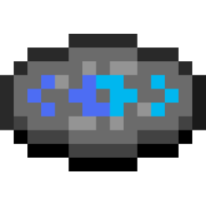
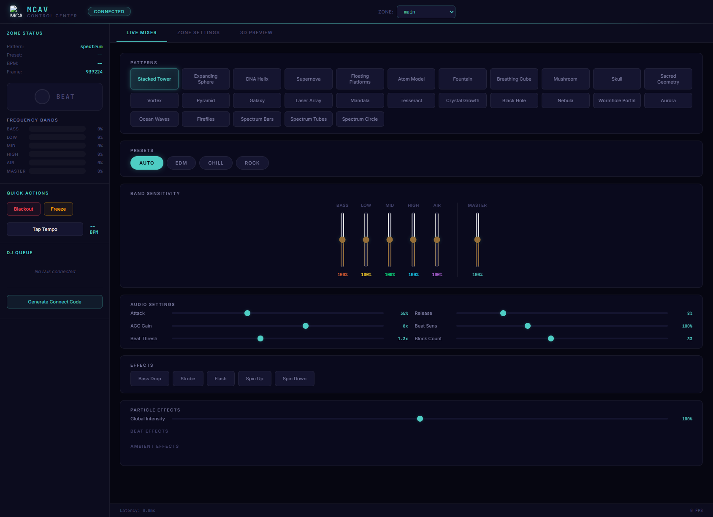
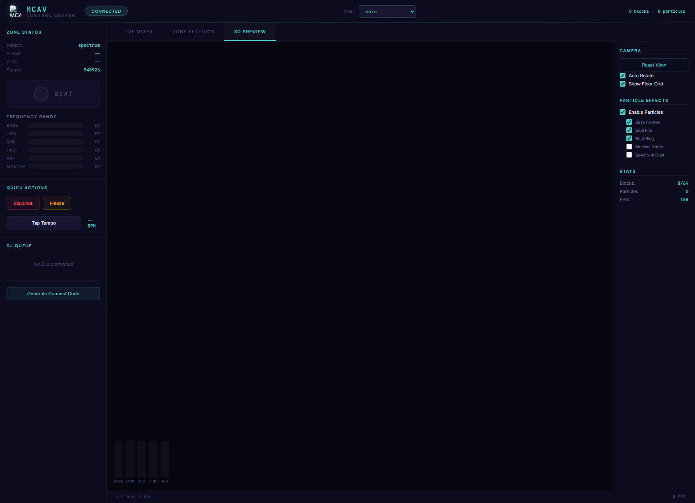
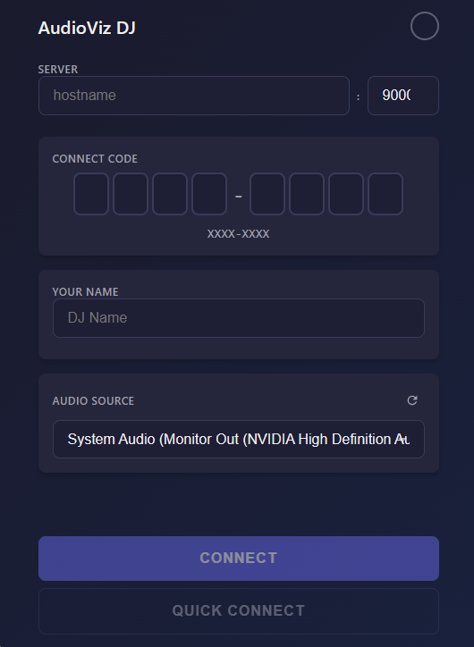
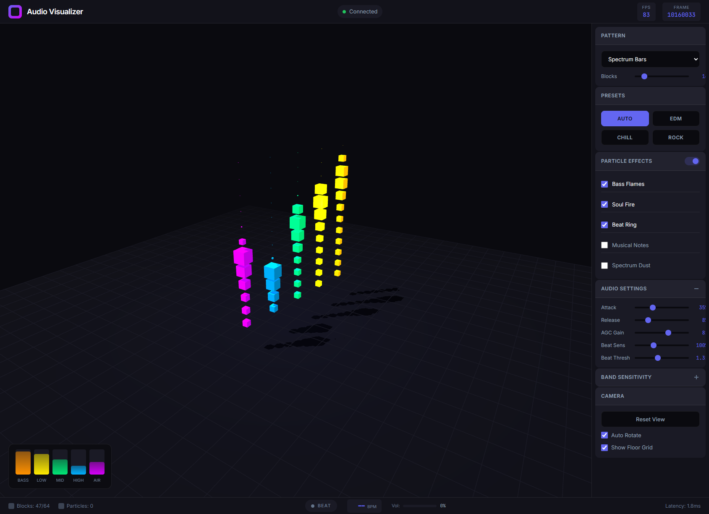
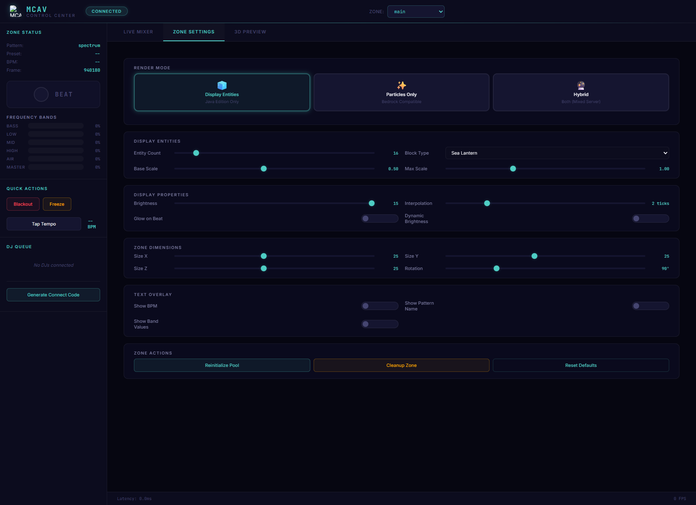

<div align="center">
  
  <h1>MCAV — Minecraft Audio Visualizer</h1>
  <p><strong>Real-time audio → reactive visuals in Minecraft, browser, and beyond</strong></p>

  
  
  
  
</div>

---

<p align="center">
  
  
  
</p>

---

## Features

- **Windows Audio Capture** — per-app WASAPI capture (Spotify, Chrome, any audio source)
- **Real-time FFT Analysis** — 5-band frequency processing with ultra-low latency (~20ms)
- **27 Visualization Patterns** — from Spectrum Bars to Galaxy Spirals, Black Holes, Auroras, and more
- **6 Audio Presets** — auto, edm, chill, rock, hiphop, classical
- **Minecraft Rendering** — Display Entity batching with interpolation, zone management, beat-reactive particles
- **3D Browser Preview** — WebGL scene with full Minecraft rendering parity
- **Admin Control Panel** — VJ-style control surface with live meters, effects, and zone controls
- **DJ Client** — cross-platform Tauri desktop app for remote DJ sessions
- **Multi-DJ Support** — multiple remote DJs performing with centralized VJ control
- **Bedrock Mode** — particle-based visualization for Geyser/Bedrock players
- **Timeline System** — pre-program timed shows with pattern, preset, and effect cues
- **Docker Deployment** — containerized VJ server for production events

---

## Quick Start

**Requirements:** Windows, Python 3.11+, and optionally Java 21 + Paper 1.21.1+ for Minecraft

```bash
# 1. Clone & install
git clone https://github.com/ryanthemcpherson/minecraft-audio-viz.git
cd minecraft-audio-viz
uv pip install -e .          # or: pip install -e ".[full]"

# 2. Run with browser preview
audioviz --app spotify --preview

# 3. Open in browser
#    3D Preview:   http://localhost:8080
#    Admin Panel:  http://localhost:8080/admin/
```

To connect to Minecraft, build the plugin (`cd minecraft_plugin && mvn package`), drop the jar into your server's `plugins/` folder, and run:

```bash
audioviz --app spotify --host your-mc-server
```

---

## Architecture

### Single DJ Mode (default)

```text
┌─────────────────┐     ┌──────────────────┐     ┌─────────────────┐
│  Audio Source   │────▶│  Audio Processor │────▶│   Minecraft      │
│ (Spotify/Chrome)│     │   (Python/FFT)   │     │    Plugin        │
└─────────────────┘     └────────┬─────────┘     └─────────────────┘
                                 │
                    ┌────────────┴────────────┐
                    ▼                         ▼
           ┌───────────────┐         ┌───────────────┐
           │ Browser 3D    │         │ Admin Panel   │
           │ Preview       │         │ Control UI    │
           └───────────────┘         └───────────────┘
```

### Multi-DJ Mode (live events)

```text
┌──────────────┐
│ DJ 1 (Remote)│───┐
│ --dj-relay   │   │
└──────────────┘   │    ┌────────────────┐     ┌─────────────────┐
                   ├───▶│    VJ Server    │────▶│    Minecraft     │
┌──────────────┐   │    │   (Central)     │     │    (Shared)      │
│ DJ 2 (Remote)│───┤    └───────┬────────┘     └─────────────────┘
│ --dj-relay   │   │            │
└──────────────┘   │    ┌───────┴────────┐
                   │    ▼                ▼
┌──────────────┐   │ ┌───────────┐ ┌───────────┐
│ DJ 3 (Remote)│───┘ │  Viewers   │ │  VJ Admin  │
│ --dj-relay   │     │ (Browser)  │ │   Panel    │
└──────────────┘     └───────────┘ └───────────┘
```

---

## Screenshots & Demo

### Admin Control Panel


### 3D Browser Preview


### Zone Management


### Multi-DJ Setup


**Demo Video:** [Watch on YouTube](https://www.youtube.com/watch?v=zH30YXrc2uw)

---

## Visualization Patterns (27)

| Pattern | Key | Description |
|---------|-----|-------------|
| Spectrum Bars | `bars` | Classic frequency bar display |
| Stacked Tower | `spectrum` | Vertical stacking bars |
| Spectrum Tubes | `tubes` | 3D tube-based spectrum analyzer |
| Spectrum Circle | `circle` | Circular spectrum layout |
| DNA Helix | `wave` | Double helix rotating structure |
| Atom Model | `orbit` | Orbital electron visualization |
| Expanding Sphere | `ring` | Pulsing sphere that expands with bass |
| Floating Platforms | `columns` | Suspended platforms responding to audio |
| Fountain | `matrix` | Particle fountain effect |
| Breathing Cube | `heartbeat` | Cube that expands/contracts with music |
| Mushroom | `mushroom` | Organic mushroom-shaped visualization |
| Skull | `skull` | Beat-reactive skull pattern |
| Sacred Geometry | `sacred` | Mathematical sacred geometry patterns |
| Vortex | `vortex` | Spinning vortex tunnel |
| Pyramid | `pyramid` | Egyptian pyramid with audio response |
| Galaxy Spiral | `galaxy` | Spiral galaxy visualization |
| Laser Array | `laser` | Concert-style laser beam array |
| Supernova | `explode` | Explosive supernova effect |
| Mandala | `mandala` | Symmetrical mandala visualization |
| Tesseract | `tesseract` | 4D hypercube projection |
| Crystal Growth | `crystal` | Growing crystal structure |
| Black Hole | `blackhole` | Gravitational lensing effect |
| Nebula | `nebula` | Space nebula cloud |
| Wormhole Portal | `wormhole` | Wormhole tunnel visualization |
| Aurora | `aurora` | Northern lights effect |
| Ocean Waves | `ocean` | Ocean wave simulation |
| Fireflies | `fireflies` | Swarm of glowing fireflies |

---

## CLI Reference

```bash
# Local DJ mode
audioviz --app spotify                    # capture Spotify
audioviz --app chrome --preview           # capture Chrome + web preview
audioviz --host 192.168.1.100             # send to remote Minecraft server
audioviz --low-latency                    # ultra-low latency (~20ms)
audioviz --test                           # run without Minecraft

# VJ server (multi-DJ)
audioviz-vj                               # start VJ server
audioviz-vj --port 9000                   # custom DJ port

# Utilities
audioviz --list-apps                      # list capturable applications
audioviz --list-devices                   # list audio devices
```

### Options

```text
--app NAME          Application to capture audio from (default: spotify)
--host HOST         Minecraft server host (default: localhost)
--port PORT         Minecraft WebSocket port (default: 8765)

--preview           Enable browser preview server
--preview-port      WebSocket port for browser (default: 8766)
--http-port         HTTP port for web interface (default: 8080)

--low-latency       Enable ultra-low latency mode (~20ms)
--no-minecraft      Run without Minecraft connection
--no-fft            Disable FFT analysis (use synthetic bands)

--entities N        Number of visualization entities (default: 16)
--zone NAME         Visualization zone name (default: main)
```

---

## Minecraft Commands

| Command | Description |
|---------|-------------|
| `/audioviz menu` | Open the main control panel (`/av menu`, `/mcav menu`) |
| `/audioviz zone create <name>` | Create a new visualization zone |
| `/audioviz zone delete <name>` | Delete a zone |
| `/audioviz zone list` | List all zones |
| `/audioviz zone setsize <name> <x> <y> <z>` | Set zone dimensions |
| `/audioviz zone setrotation <name> <degrees>` | Set zone rotation |
| `/audioviz zone info <name>` | Show zone details |
| `/audioviz pool init <zone> [count] [material]` | Initialize display-entity pool |
| `/audioviz pool cleanup <zone>` | Remove zone entities |
| `/audioviz test <zone> <wave\|pulse\|random>` | Run test animation |
| `/audioviz status` | Show plugin status |
| `/audioviz help` | Show command help |

---

<details>
<summary><strong>Multi-DJ Mode (Live Events)</strong></summary>

### 1) Start the VJ Server (central control)

```bash
python -m audio_processor.vj_server --no-minecraft
```

Defaults:
- DJ connection port: `ws://localhost:9000`
- Browser preview: `http://localhost:8080`
- Admin panel: `http://localhost:8080/admin/`

### 2) DJs connect in relay mode (each DJ machine)

```bash
python -m audio_processor.app_capture --dj-relay \
  --vj-server ws://VJ_SERVER_IP:9000 \
  --dj-name "DJ Alice" \
  --dj-id "dj_alice" \
  --dj-key "alice123"
```

### 3) Optional: DJ authentication (recommended)

Generate bcrypt hashes:

```bash
python -m audio_processor.auth hash "mysecretpassword"
python -m audio_processor.auth init configs/dj_auth.json
```

`configs/dj_auth.json` is intentionally gitignored. Start from `configs/dj_auth.example.json` and keep real keys local.

Example `configs/dj_auth.json`:

```json
{
  "djs": {
    "dj_alice": {"name": "DJ Alice", "key_hash": "bcrypt:$2b$12$...", "priority": 1},
    "dj_bob": {"name": "DJ Bob", "key_hash": "bcrypt:$2b$12$...", "priority": 2}
  }
}
```

For production, run the VJ server with `--require-auth`.

</details>

<details>
<summary><strong>Minecraft Plugin Features</strong></summary>

### GUI menu system
- Main menu (system status)
- DJ control panel (effects, presets, zone selection)
- Settings menu (performance tuning)
- Zone management + zone editor (size/rotation/entity pools)

### Beat effects
- Particle bursts on beats
- Screen shake on bass drops
- Lightning strikes on drops
- Explosion visuals

### Performance optimizations
- Batched entity updates (single scheduler per tick)
- Async JSON parsing on a dedicated thread
- Tick-based message queue
- View distance culling
- Entity pool management + interpolation

### Bedrock Mode (Geyser)
Bedrock players can't see Display Entities, so use particles:
- Switch to **Particles** or **Hybrid** mode in Admin Panel
- Particle types: `DUST`, `FLAME`, `SOUL_FIRE_FLAME`, `END_ROD`, `NOTE`
- Color modes: frequency-based, rainbow, intensity, fixed color
- Adjustable density + particle size

</details>

<details>
<summary><strong>Timeline System</strong></summary>

Pre-program visualization shows:
- **Tracks:** Patterns, Presets, Effects, Parameters
- **Cues:** timed events that trigger actions
- **Triggers:** time-based, beat-synced, or manual
- **Transport:** play/pause/stop/seek

</details>

<details>
<summary><strong>Docker Support</strong></summary>

The VJ server can run in Docker for deployment:

```bash
docker-compose up -d
docker-compose logs -f vj-server

MINECRAFT_HOST=mc.example.com docker-compose up -d
```

> Note: **Audio capture requires Windows** and cannot run in Docker. DJs run locally and connect to the containerized VJ server.

</details>

---

## Project Structure

```text
minecraft-audio-viz/
├── audio_processor/       # Python audio processing + FFT + patterns
├── admin_panel/           # Web control panel (VJ interface)
├── dj_client/             # Desktop DJ client (Tauri + React)
├── preview_tool/          # 3D browser preview (Three.js)
├── minecraft_plugin/      # Paper plugin (Java 21)
├── python_client/         # VizClient WebSocket library
├── protocol/              # Shared protocol schemas
├── configs/               # Configuration files
├── docs/                  # Architecture and ops docs
├── scripts/               # PowerShell quick-start scripts
├── shows/                 # Saved show files
└── images/         # Screenshots
```

---

## Development

```bash
pip install -e ".[dev]"
pytest
ruff check audio_processor/ python_client/

cd minecraft_plugin && mvn package
```

---

## Known Limitations

- **Windows-only audio capture** — WASAPI is required for per-application audio capture. The VJ server can run on Linux/Docker, but DJs must run on Windows.
- **Display Entities require Java Edition** — Bedrock players (via Geyser) need to use Particles mode instead.
- **Low-frequency resolution limited** — 1024-sample FFT at 48kHz cannot accurately detect frequencies below ~43Hz, so sub-bass (20-40Hz) is excluded from the 5-band system.

---

## License

MIT — see [LICENSE](LICENSE)
