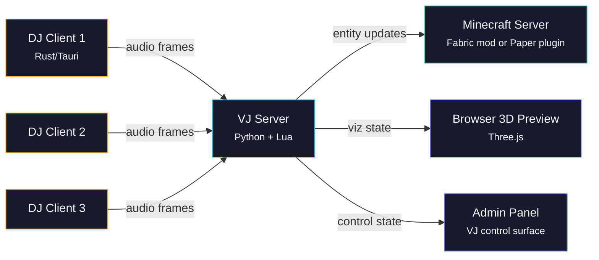
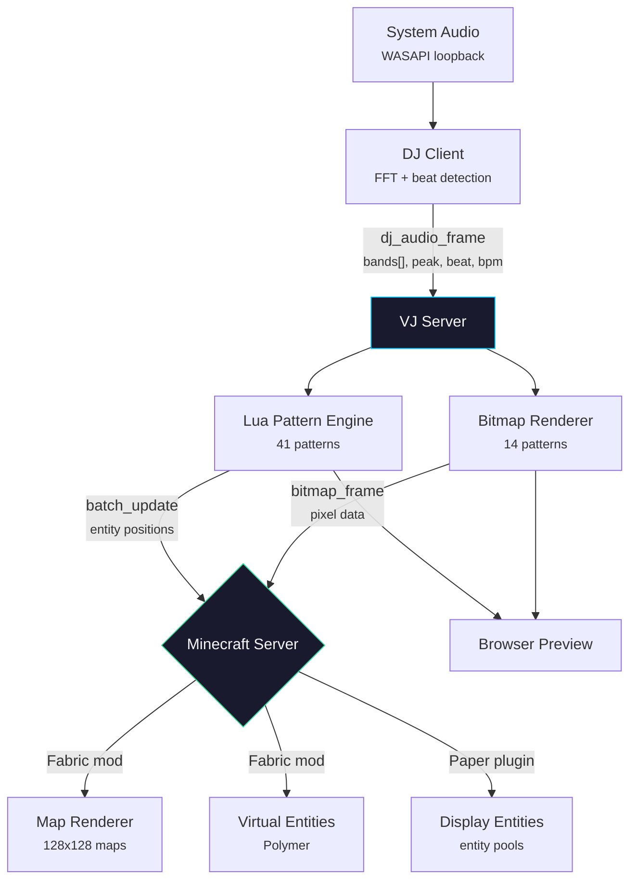
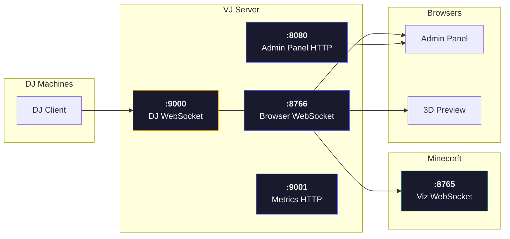
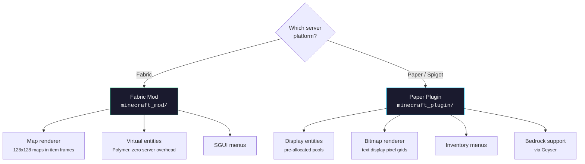

<div align="center">
  
  <h1>MCAV — Minecraft Audio Visualizer</h1>
  <p><strong>Real-time audio → reactive visuals in Minecraft, browser, and beyond</strong></p>

  [](https://github.com/ryanthemcpherson/minecraft-audio-viz/actions/workflows/ci.yml)
  [](https://github.com/ryanthemcpherson/minecraft-audio-viz/actions/workflows/deploy.yml)
  [](https://github.com/ryanthemcpherson/minecraft-audio-viz/actions/workflows/security.yml)

  
  
  
  
  
  
  
</div>

---

<p align="center">
  
  
  
</p>

---

## Table of Contents

- [Features](#features)
- [Quick Start](#quick-start)
- [Architecture](#architecture)
- [Minecraft Integration](#minecraft-integration)
- [Screenshots & Demo](#screenshots--demo)
- [Visualization Patterns](#visualization-patterns)
- [CLI Reference](#cli-reference)
- [Minecraft Commands](#minecraft-commands)
- [Project Structure](#project-structure)
- [Development](#development)
- [Known Limitations](#known-limitations)
- [Acknowledgments](#acknowledgments)
- [License](#license)

---

## Features

- **Windows Audio Capture** — per-app WASAPI capture (Spotify, Chrome, any audio source)
- **Real-time FFT Analysis** — 5-band frequency processing with ultra-low latency (~20ms)
- **55+ Visualization Patterns** — 41 Lua 3D patterns + 14 bitmap 2D patterns, from Spectrum Bars to Galaxy Spirals, Auroras, Plasma, and more
- **Dual Render Backends** — high-res map tile displays (128x128 per tile) and entity LED walls, switchable per zone
- **6 Audio Presets** — auto, edm, chill, rock, hiphop, classical
- **Two Minecraft Integrations** — Fabric mod and Paper plugin, both connecting to the same VJ server (see [comparison](#minecraft-integration))
- **3D Browser Preview** — WebGL scene with full Minecraft rendering parity
- **Admin Control Panel** — VJ-style control surface with live meters, effects, and zone controls
- **DJ Client** — cross-platform Tauri desktop app (Rust) for remote DJ sessions
- **Multi-DJ Support** — multiple remote DJs performing with centralized VJ control
- **Stage System** — multi-zone stages with decorators, spotlight effects, and DJ billboards
- **Timeline System** — pre-program timed shows with pattern, preset, and effect cues
- **Coordinator API** — central DJ coordination with connect codes, show management, and JWT auth
- **Docker Deployment** — containerized VJ server for production events

---

## Quick Start

### Try the Demo (Zero Install)

**Requirements:** Docker only

Experience MCAV in your browser with simulated audio:

```bash
git clone https://github.com/ryanthemcpherson/minecraft-audio-viz.git
cd minecraft-audio-viz
docker compose -f docker-compose.demo.yml up
```

Then open:
- **http://localhost:8080** - Admin Panel (VJ server)
- **http://localhost:8081** - 3D Preview (nginx)

See [`demo/README.md`](demo/README.md) for full details.

### Download DJ Client (Recommended)

**[Download Latest Release](https://github.com/ryanthemcpherson/minecraft-audio-viz/releases)**

The DJ Client is a cross-platform desktop app (Windows/macOS/Linux) for capturing and streaming audio:

1. Download the installer for your platform from [GitHub Releases](https://github.com/ryanthemcpherson/minecraft-audio-viz/releases)
2. Install and launch the DJ Client
3. Select your audio source (Spotify, Chrome, system audio, etc.)
4. Connect to a VJ server or run in standalone mode with browser preview

### VJ Server Setup

**Requirements:** Python 3.11+ (VJ server can run on any platform)

```bash
# 1. Clone & install VJ server
git clone https://github.com/ryanthemcpherson/minecraft-audio-viz.git
cd minecraft-audio-viz
pip install -e vj_server/     # Install VJ server package

# 2. Start VJ server (multi-DJ mode)
audioviz-vj                   # Starts on port 9000

# 3. Open in browser
#    Admin Panel:  http://localhost:8080
#    Browser WS:   ws://localhost:8766 (used by 3D preview)
```

### Minecraft Setup (Optional)

To render visualizations inside Minecraft, install either the Fabric mod or the Paper plugin. Both connect to the same VJ server — pick whichever matches your server platform.

**Fabric mod:**
```bash
cd minecraft_mod && ./gradlew build
# Copy build/libs/audioviz-mod-*.jar to your server's mods/ folder
# Requires: Fabric Loader, Fabric API, SGUI, Polymer
```

**Paper plugin:**
```bash
cd minecraft_plugin && mvn package
# Copy target/audioviz-plugin-*.jar to your server's plugins/ folder
# No additional dependencies required
```

Then point the VJ server at your Minecraft server:
```bash
audioviz-vj --minecraft-host your-mc-server
```

See [Minecraft Integration](#minecraft-integration) for a detailed comparison.

---

## Architecture

### System Overview


```mermaid
graph LR
    DJ1[DJ Client 1<br/><small>Rust/Tauri</small>] -->|audio frames| VJ[VJ Server<br/><small>Python + Lua</small>]
    DJ2[DJ Client 2] -->|audio frames| VJ
    DJ3[DJ Client 3] -->|audio frames| VJ

    VJ -->|entity updates| MC[Minecraft Server<br/><small>Fabric mod or Paper plugin</small>]
    VJ -->|viz state| BP[Browser 3D Preview<br/><small>Three.js</small>]
    VJ -->|control state| AP[Admin Panel<br/><small>VJ control surface</small>]

    style VJ fill:#1a1a2e,stroke:#00ccff,color:#f5f5f5
    style MC fill:#1a1a2e,stroke:#2fe098,color:#f5f5f5
    style DJ1 fill:#1a1a2e,stroke:#ffaa00,color:#f5f5f5
    style DJ2 fill:#1a1a2e,stroke:#ffaa00,color:#f5f5f5
    style DJ3 fill:#1a1a2e,stroke:#ffaa00,color:#f5f5f5
    style BP fill:#1a1a2e,stroke:#5b6aff,color:#f5f5f5
    style AP fill:#1a1a2e,stroke:#5b6aff,color:#f5f5f5
```

### Data Flow


```mermaid
graph TD
    A[System Audio<br/><small>WASAPI loopback</small>] --> B[DJ Client<br/><small>FFT + beat detection</small>]
    B -->|"dj_audio_frame<br/><small>bands[], peak, beat, bpm</small>"| C[VJ Server]
    C --> D[Lua Pattern Engine<br/><small>41 patterns</small>]
    C --> E[Bitmap Renderer<br/><small>14 patterns</small>]
    D -->|"batch_update<br/><small>entity positions</small>"| F{Minecraft Server}
    E -->|"bitmap_frame<br/><small>pixel data</small>"| F
    D --> G[Browser Preview]
    E --> G

    F -->|Fabric mod| H[Map Renderer<br/><small>128x128 maps</small>]
    F -->|Fabric mod| I[Virtual Entities<br/><small>Polymer</small>]
    F -->|Paper plugin| J[Display Entities<br/><small>entity pools</small>]

    style C fill:#1a1a2e,stroke:#00ccff,color:#f5f5f5
    style F fill:#1a1a2e,stroke:#2fe098,color:#f5f5f5
```

### Network Ports


```mermaid
graph LR
    subgraph DJ Machines
        DJC[DJ Client]
    end

    subgraph VJ Server
        DJ_PORT["<b>:9000</b><br/>DJ WebSocket"]
        BR_PORT["<b>:8766</b><br/>Browser WebSocket"]
        HTTP_PORT["<b>:8080</b><br/>Admin Panel HTTP"]
        MET_PORT["<b>:9001</b><br/>Metrics HTTP"]
    end

    subgraph Minecraft
        MC_PORT["<b>:8765</b><br/>Viz WebSocket"]
    end

    subgraph Browsers
        ADMIN[Admin Panel]
        PREVIEW[3D Preview]
    end

    DJC --> DJ_PORT
    DJ_PORT --- BR_PORT
    BR_PORT --> MC_PORT
    BR_PORT --> ADMIN
    BR_PORT --> PREVIEW
    HTTP_PORT --> ADMIN

    style DJ_PORT fill:#1a1a2e,stroke:#ffaa00,color:#f5f5f5
    style BR_PORT fill:#1a1a2e,stroke:#5b6aff,color:#f5f5f5
    style MC_PORT fill:#1a1a2e,stroke:#2fe098,color:#f5f5f5
    style HTTP_PORT fill:#1a1a2e,stroke:#5b6aff,color:#f5f5f5
    style MET_PORT fill:#1a1a2e,stroke:#5b6aff,color:#f5f5f5
```

| Port | Protocol | Purpose |
|-|-|-|
| 8765 | WebSocket | Minecraft mod/plugin ↔ VJ server |
| 8766 | WebSocket | Browser clients (3D preview, admin panel) |
| 9000 | WebSocket | DJ clients → VJ server |
| 8080 | HTTP | Admin panel + 3D preview web UI |
| 9001 | HTTP | Prometheus-compatible metrics (optional) |

---

## Minecraft Integration

MCAV provides two ways to render visualizations in Minecraft. Both receive the same data from the VJ server — choose based on your server platform.

### Choosing: Fabric Mod vs Paper Plugin


```mermaid
graph TD
    Q{Which server<br/>platform?} -->|Fabric| FM[Fabric Mod<br/><code>minecraft_mod/</code>]
    Q -->|Paper / Spigot| PP[Paper Plugin<br/><code>minecraft_plugin/</code>]

    FM --> FB1[Map renderer<br/><small>128x128 maps in item frames</small>]
    FM --> FB2[Virtual entities<br/><small>Polymer, zero server overhead</small>]
    FM --> FB3[SGUI menus]

    PP --> PB1[Display entities<br/><small>pre-allocated pools</small>]
    PP --> PB2[Bitmap renderer<br/><small>text display pixel grids</small>]
    PP --> PB3[Inventory menus]
    PP --> PB4[Bedrock support<br/><small>via Geyser</small>]

    style FM fill:#1a1a2e,stroke:#2fe098,color:#f5f5f5
    style PP fill:#1a1a2e,stroke:#00ccff,color:#f5f5f5
```

| Feature | Fabric Mod | Paper Plugin |
|-|-|-|
| **Server platform** | Fabric Loader + Fabric API | Paper or Spigot |
| **3D patterns (Lua)** | Virtual entities (Polymer) | Display entities (pooled) |
| **2D patterns (bitmap)** | Map renderer (128x128 tiles) | Text display pixel grid |
| **GUI system** | SGUI server-side menus | Inventory-based menus |
| **Bedrock players** | Not supported | Supported (via Geyser) |
| **Bundle packets** | Yes (atomic frame updates) | No |
| **Dependencies** | Fabric API, SGUI, Polymer | None |
| **Bandwidth (64x36 bitmap)** | ~4 KB/tick (10 packets) | ~1.15 MB/tick (23K packets) |
| **Entity overhead** | Zero (virtual) | Real entities (pooled) |
| **Beat effects** | Particles, ambient lighting, stage decorators | Particles, ambient lighting, stage decorators |

**Summary:** The Fabric mod has better rendering performance (virtual entities, map-based bitmaps, bundle packets). The Paper plugin has simpler setup (no extra dependencies) and supports Bedrock players. Both provide the full visualization experience — the same patterns, the same VJ server, the same controls.

### Shared Capabilities

Both the mod and plugin provide:

- **Zone management** — create, position, resize, and rotate visualization zones
- **Pattern switching** — all 41 Lua 3D patterns + 14 bitmap patterns
- **Beat-reactive effects** — particle bursts, ambient lighting, stage decorators
- **Stage system** — multi-zone stages with spotlights, DJ billboards, and floor tiles
- **Admin menus** — in-game GUI for zone/stage/pattern control
- **WebSocket connection** — receives `batch_update` and `bitmap_frame` messages on port 8765
- **Audio presets** — auto, edm, chill, rock, hiphop, classical

---

## Screenshots & Demo

### Admin Control Panel


### 3D Browser Preview


### Zone Management


**Demo Video:** [Watch on YouTube](https://www.youtube.com/watch?v=zH30YXrc2uw)

---

## Visualization Patterns

### Lua 3D Patterns (41)

3D entity-based patterns computed by the VJ server's Lua engine. Rendered in Minecraft by the Fabric mod (virtual entities) or Paper plugin (display entities), and mirrored in the browser 3D preview.

| Pattern | Key | Description |
|-|-|-|
| Spectrum Bars | `bars` | Classic frequency bar display |
| Stacked Tower | `spectrum` | Vertical stacking bars |
| Spectrum Tubes | `tubes` | 3D tube-based spectrum analyzer |
| Spectrum Circle | `circle` | Circular spectrum layout |
| DNA Helix | `wave` | Double helix rotating structure |
| Atom Model | `orbit` | Orbital electron visualization |
| Expanding Sphere | `ring` | Pulsing sphere that expands with bass |
| Floating Platforms | `columns` | Suspended platforms responding to audio |
| Fountain | `matrix` | Particle fountain effect |
| Breathing Cube | `heartbeat` | Cube that expands/contracts with music |
| Mushroom | `mushroom` | Organic mushroom-shaped visualization |
| Skull | `skull` | Beat-reactive skull pattern |
| Sacred Geometry | `sacred` | Mathematical sacred geometry patterns |
| Vortex | `vortex` | Spinning vortex tunnel |
| Pyramid | `pyramid` | Egyptian pyramid with audio response |
| Galaxy Spiral | `galaxy` | Spiral galaxy visualization |
| Laser Array | `laser` | Concert-style laser beam array |
| Supernova | `explode` | Explosive supernova effect |
| Mandala | `mandala` | Symmetrical mandala visualization |
| Tesseract | `tesseract` | 4D hypercube projection |
| Crystal Growth | `crystal` | Growing crystal structure |
| Black Hole | `blackhole` | Gravitational lensing effect |
| Nebula | `nebula` | Space nebula cloud |
| Wormhole Portal | `wormhole` | Wormhole tunnel visualization |
| Aurora | `aurora` | Northern lights effect |
| Ocean Waves | `ocean` | Ocean wave simulation |
| Fireflies | `fireflies` | Swarm of glowing fireflies |
| Laser Fan | `laserfan` | Scanning laser fan array |
| Moving Heads | `movingheads` | Concert moving head lights |
| Pyrotechnics | `pyro` | Stage pyro flame effects |
| Shockwave | `shockwave` | Expanding shockwave rings |
| Crown | `crown` | Rotating crown structure |
| Dragon | `dragon` | Beat-reactive dragon form |
| Phoenix | `phoenix` | Rising phoenix visualization |
| Fist | `fist` | Pumping fist animation |
| Sword | `sword` | Glowing sword visualization |
| LED Wall | `ledwall` | Flat LED grid rendering |
| Drop Sequence | `dropsequence` | Build-up and drop animation |
| BPM Pulse | `bpm_pulse` | BPM-synced pulsing effect |
| BPM Strobe | `bpm_strobe` | BPM-synced strobe effect |
| Strobe | `strobe` | Classic strobe effect |

### Bitmap Patterns (14)

Flat 2D pixel-grid patterns. The Fabric mod renders these via map tile displays (128x128 per tile, glow item frames). The Paper plugin renders them via text display entities as individually-addressable pixels. Both support effects processing and layer compositing.

| Pattern | Key | Description |
|-|-|-|
| Spectrum Bars | `bmp_spectrum_bars` | Classic LED bar graph with color mapping |
| Spectrogram | `bmp_spectrogram` | Scrolling frequency x time heat map |
| Plasma | `bmp_plasma` | Audio-reactive plasma shader |
| Circular Spectrum | `bmp_circular` | Radial spectrum analyzer |
| Fire | `bmp_fire` | Fluid fire simulation |
| Matrix Rain | `bmp_matrix_rain` | Digital rain cascade |
| Starfield | `bmp_starfield` | Warp-speed starfield |
| Concentric Rings | `bmp_rings` | Expanding ring visualization |
| Aurora | `bmp_aurora` | Northern lights effect |
| Tunnel Zoom | `bmp_tunnel` | Infinite tunnel zoom |
| Kaleidoscope | `bmp_kaleidoscope` | Symmetrical kaleidoscope effect |
| Galaxy | `bmp_galaxy` | Spiral galaxy with star particles |
| Lightning | `bmp_lightning` | Beat-triggered lightning bolts |
| Rotating Geometry | `bmp_geometry` | Rotating 3D wireframes |

---

## CLI Reference

### VJ Server Commands

```bash
# Start VJ server (multi-DJ mode)
audioviz-vj                               # start on default port 9000
audioviz-vj --port 9000                   # custom DJ port
audioviz-vj --minecraft-host mc.local     # connect to Minecraft server
audioviz-vj --no-auth                     # dev mode - skip authentication
audioviz-vj --metrics-port 9001           # health metrics endpoint
```

### DJ Client

The DJ Client is a desktop GUI app. Audio source selection and streaming controls are in the app interface.

**Download:** [GitHub Releases](https://github.com/ryanthemcpherson/minecraft-audio-viz/releases)

For development, see `dj_client/README.md`

---

## Minecraft Commands

Both the Fabric mod and Paper plugin use the same `/audioviz` command tree:

| Command | Description |
|-|-|
| `/audioviz menu` | Open the main control panel (`/av menu`, `/mcav menu`) |
| `/audioviz zone create <name>` | Create a new visualization zone |
| `/audioviz zone delete <name>` | Delete a zone |
| `/audioviz zone list` | List all zones |
| `/audioviz zone setsize <name> <x> <y> <z>` | Set zone dimensions |
| `/audioviz zone setrotation <name> <degrees>` | Set zone rotation |
| `/audioviz zone info <name>` | Show zone details |
| `/audioviz test <zone> <wave\|pulse\|random>` | Run test animation |
| `/audioviz status` | Show connection and system status |
| `/audioviz help` | Show command help |

---

<details>
<summary><strong>Multi-DJ Mode (Live Events)</strong></summary>

### 1) Start the VJ Server (central control)

```bash
audioviz-vj
```

Defaults:
- DJ connection port: `ws://localhost:9000`
- Browser preview: `http://localhost:8080`
- Admin panel: `http://localhost:8081`

### 2) DJs connect using DJ Client (each DJ machine)

1. Download and install the [DJ Client](https://github.com/ryanthemcpherson/minecraft-audio-viz/releases)
2. Launch the DJ Client
3. Enter VJ server connection details (host, port, DJ name, connect code)
4. Select audio source and start streaming

### 3) Optional: DJ authentication (recommended)

The VJ server supports connect-code authentication for multi-DJ sessions. Configure DJ credentials in `vj_server/config.py` or use environment variables.

For production, the VJ server enforces authentication by default.

</details>

<details>
<summary><strong>In-Game Features (both mod and plugin)</strong></summary>

### GUI menu system
- Main menu (system status, active zones, connection info)
- DJ control panel (effects, presets, zone selection)
- Stage management (create/edit stages, assign zone roles)
- VJ control panel (pattern selection, intensity slider, render mode toggle)
- Zone management + zone editor (size/rotation/placement)
- Stage decorator menus (spotlights, DJ banners, floor tiles)
- Settings menu (performance tuning)

### Beat effects
- Particle bursts on beats (bass flame, beat ring, spectrum dust, ambient mist)
- Beat event system with configurable thresholds
- Ambient lighting that responds to audio state
- Stage decorators (spotlights, DJ billboards, floor tiles, beat text FX)

### Render backends

**Fabric mod:**
- Map display — high-resolution 128x128 pixel maps in glow item frames, dirty-rect tracking for efficient updates
- Virtual entity LED wall — Polymer virtual block display entities as individually-addressable pixels
- Bundle packets for tear-free frame updates

**Paper plugin:**
- Display entity pools — pre-allocated real entities with interpolation
- Text display pixel grid — individually-addressable pixels via text display background color
- Async bitmap rendering on dedicated thread pool

</details>

<details>
<summary><strong>Timeline System</strong></summary>

Pre-program visualization shows:
- **Tracks:** Patterns, Presets, Effects, Parameters
- **Cues:** timed events that trigger actions
- **Triggers:** time-based, beat-synced, or manual
- **Transport:** play/pause/stop/seek

</details>

<details>
<summary><strong>Docker Support</strong></summary>

The VJ server can run in Docker for deployment:

```bash
docker-compose up -d
docker-compose logs -f vj-server

MINECRAFT_HOST=mc.example.com docker-compose up -d
```

> Note: **Audio capture requires Windows** and cannot run in Docker. DJs run locally and connect to the containerized VJ server.

</details>

---

## Project Structure

```text
minecraft-audio-viz/
├── dj_client/             # DJ Client (Rust/Tauri, audio capture + FFT)
├── vj_server/             # VJ Server (Python, Lua pattern engine + routing)
├── minecraft_mod/         # Fabric mod (Java 21, MC 1.21.1)
├── minecraft_plugin/      # Paper/Spigot plugin (Java 21, MC 1.21.1)
├── admin_panel/           # Web control panel (VJ interface)
├── preview_tool/          # 3D browser preview (Three.js)
├── site/                  # Landing page (Next.js 15, mcav.live)
├── coordinator/           # DJ coordinator API (FastAPI, PostgreSQL)
├── community_bot/         # Discord community bot (discord.py)
├── discord_bot/           # Discord voice audio capture bot
├── worker/                # Tenant router (Cloudflare Workers)
├── protocol/              # Shared WebSocket protocol schemas
├── patterns/              # Lua 3D visualization patterns (41)
├── configs/               # Configuration files
├── docs/                  # Architecture and ops docs
├── scripts/               # PowerShell quick-start scripts
├── shows/                 # Saved show files
└── archive/               # Archived components
    └── python_dj_cli/     # Old Python DJ CLI (deprecated)
```

### Web Platform (mcav.live)

| Component | Path | Stack | Purpose |
|-|-|-|-|
| Landing Site | `site/` | Next.js 15, Tailwind CSS 4, Three.js | Product page, pattern gallery, getting started |
| Coordinator | `coordinator/` | FastAPI, SQLAlchemy, PostgreSQL | DJ connect codes, show management, JWT auth |
| Tenant Router | `worker/` | Cloudflare Workers, TypeScript | Multi-tenant subdomain routing |

---

## Development

```bash
# VJ Server
cd vj_server && pip install -e ".[dev]" && pytest

# Minecraft Mod (Fabric)
cd minecraft_mod && ./gradlew build

# Minecraft Plugin (Paper)
cd minecraft_plugin && mvn package

# DJ Client (Rust/Tauri)
cd dj_client && npm install && npm run tauri dev

# Coordinator API
cd coordinator && pip install -e ".[dev]" && pytest

# Site (Next.js)
cd site && npm install && npm run dev
```

---

## Known Limitations

- **Windows-only audio capture** — WASAPI is required for per-application audio capture. The VJ server can run on Linux/Docker, but DJs must run on Windows.
- **Java Edition only** — Both the Fabric mod and Paper plugin require Java Edition 1.21.1+.
- **Low-frequency resolution limited** — 1024-sample FFT at 48kHz cannot accurately detect frequencies below ~43Hz, so sub-bass (20-40Hz) is excluded from the 5-band system.

---

## Acknowledgments

The **Bitmap LED Wall** rendering system was inspired by [TheCymaera's Minecraft Text Display Experiments](https://github.com/TheCymaera/minecraft-text-display-experiments) ([video](https://youtu.be/uZmEYYs0ZKs)). TheCymaera pioneered the technique of using text display entities as individually-addressable pixels — setting `text` to a space character and manipulating the `background` ARGB value to create flat pixel grids, bitmap displays, and interactive paint canvases within Minecraft. MCAV adapted this approach for real-time audio-reactive visualization, adding a frame buffer pipeline, VJ control protocol, transition engine, and effects processing on top of the core pixel-grid concept.

---

## License

MIT — see [LICENSE](LICENSE)
