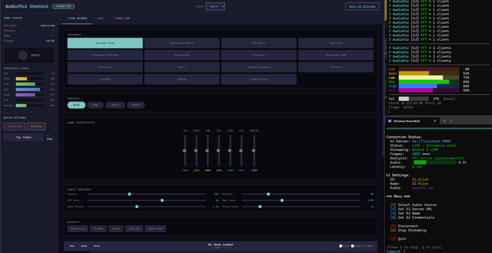

<div align="center">
  
  <h1>MCAV — Minecraft Audio Visualizer</h1>
  <p><strong>Real-time audio → reactive visuals in Minecraft, browser, and beyond</strong></p>

  [](https://github.com/ryanthemcpherson/minecraft-audio-viz/actions/workflows/ci.yml)
  [](https://github.com/ryanthemcpherson/minecraft-audio-viz/actions/workflows/deploy.yml)
  [](https://github.com/ryanthemcpherson/minecraft-audio-viz/actions/workflows/security.yml)

  
  
  
  
</div>

---

<p align="center">
  
  
  
</p>

---

## Table of Contents

- [Features](#features)
- [Quick Start](#quick-start)
- [Architecture](#architecture)
- [Screenshots & Demo](#screenshots--demo)
- [Visualization Patterns](#visualization-patterns-27)
- [CLI Reference](#cli-reference)
- [Minecraft Commands](#minecraft-commands)
- [Project Structure](#project-structure)
- [Development](#development)
- [Known Limitations](#known-limitations)
- [Acknowledgments](#acknowledgments)
- [License](#license)

---

## Features

- **Windows Audio Capture** — per-app WASAPI capture (Spotify, Chrome, any audio source)
- **Real-time FFT Analysis** — 5-band frequency processing with ultra-low latency (~20ms)
- **40 Visualization Patterns** — from Spectrum Bars to Galaxy Spirals, Black Holes, Auroras, and more
- **Bitmap LED Wall** — flat 2D pixel-grid display using text display entities as pixels, inspired by [TheCymaera](https://github.com/TheCymaera/minecraft-text-display-experiments)
- **6 Audio Presets** — auto, edm, chill, rock, hiphop, classical
- **Minecraft Rendering** — Display Entity batching with interpolation, zone management, beat-reactive particles
- **3D Browser Preview** — WebGL scene with full Minecraft rendering parity
- **Admin Control Panel** — VJ-style control surface with live meters, effects, and zone controls
- **DJ Client** — cross-platform Tauri desktop app for remote DJ sessions
- **Multi-DJ Support** — multiple remote DJs performing with centralized VJ control
- **Bedrock Mode** — particle-based visualization for Geyser/Bedrock players
- **Timeline System** — pre-program timed shows with pattern, preset, and effect cues
- **Docker Deployment** — containerized VJ server for production events

---

## Quick Start

### Try the Demo (Zero Install)

**Requirements:** Docker only

Experience MCAV in your browser with simulated audio:

```bash
git clone https://github.com/ryanthemcpherson/minecraft-audio-viz.git
cd minecraft-audio-viz
docker compose -f docker-compose.demo.yml up
```

Then open:
- **http://localhost:8080** - Admin Panel
- **http://localhost:8081** - 3D Preview

See [`demo/README.md`](demo/README.md) for full details.

### Download DJ Client (Recommended)

**[⬇️ Download Latest Release](https://github.com/ryanthemcpherson/minecraft-audio-viz/releases)**

The DJ Client is a cross-platform desktop app (Windows/macOS/Linux) for capturing and streaming audio:

1. Download the installer for your platform from [GitHub Releases](https://github.com/ryanthemcpherson/minecraft-audio-viz/releases)
2. Install and launch the DJ Client
3. Select your audio source (Spotify, Chrome, system audio, etc.)
4. Connect to a VJ server or run in standalone mode with browser preview

### VJ Server Setup

**Requirements:** Python 3.11+ (VJ server can run on any platform)

```bash
# 1. Clone & install VJ server
git clone https://github.com/ryanthemcpherson/minecraft-audio-viz.git
cd minecraft-audio-viz
pip install -e vj_server/     # Install VJ server package

# 2. Start VJ server (multi-DJ mode)
audioviz-vj                   # Starts on port 9000

# 3. Open in browser
#    3D Preview:   http://localhost:8080
#    Admin Panel:  http://localhost:8081
```

### Minecraft Plugin Setup (Optional)

To connect to Minecraft, build the plugin and drop it into your server's `plugins/` folder:

```bash
cd minecraft_plugin && mvn package
# Copy target/audioviz-plugin-*.jar to your server's plugins/ folder
# Configure VJ server: audioviz-vj --minecraft-host your-mc-server
```

---

## Architecture

### Single DJ Mode (standalone)

```text
┌─────────────────┐     ┌──────────────────┐     ┌─────────────────┐
│   DJ Client     │────▶│    VJ Server     │────▶│   Minecraft      │
│ (Rust/Tauri)    │     │  (Python/Lua)    │     │    Plugin        │
│  Audio Capture  │     │  Pattern Engine  │     │                  │
└─────────────────┘     └────────┬─────────┘     └─────────────────┘
                                 │
                    ┌────────────┴────────────┐
                    ▼                         ▼
           ┌───────────────┐         ┌───────────────┐
           │ Browser 3D    │         │ Admin Panel   │
           │ Preview       │         │ Control UI    │
           └───────────────┘         └───────────────┘
```

### Multi-DJ Mode (live events)

```text
┌──────────────┐
│  DJ Client 1 │───┐
│   (Remote)   │   │
└──────────────┘   │    ┌────────────────┐     ┌─────────────────┐
                   ├───▶│    VJ Server    │────▶│    Minecraft     │
┌──────────────┐   │    │   (Central)     │     │    (Shared)      │
│  DJ Client 2 │───┤    └───────┬────────┘     └─────────────────┘
│   (Remote)   │   │            │
└──────────────┘   │    ┌───────┴────────┐
                   │    ▼                ▼
┌──────────────┐   │ ┌───────────┐ ┌───────────┐
│  DJ Client 3 │───┘ │  Viewers   │ │  VJ Admin  │
│   (Remote)   │     │ (Browser)  │ │   Panel    │
└──────────────┘     └───────────┘ └───────────┘
```

---

## Screenshots & Demo

### Admin Control Panel


### 3D Browser Preview


### Zone Management


### Multi-DJ Setup


**Demo Video:** [Watch on YouTube](https://www.youtube.com/watch?v=zH30YXrc2uw)

---

## Visualization Patterns (40)

### 3D Entity Patterns (27)

| Pattern | Key | Description |
|---------|-----|-------------|
| Spectrum Bars | `bars` | Classic frequency bar display |
| Stacked Tower | `spectrum` | Vertical stacking bars |
| Spectrum Tubes | `tubes` | 3D tube-based spectrum analyzer |
| Spectrum Circle | `circle` | Circular spectrum layout |
| DNA Helix | `wave` | Double helix rotating structure |
| Atom Model | `orbit` | Orbital electron visualization |
| Expanding Sphere | `ring` | Pulsing sphere that expands with bass |
| Floating Platforms | `columns` | Suspended platforms responding to audio |
| Fountain | `matrix` | Particle fountain effect |
| Breathing Cube | `heartbeat` | Cube that expands/contracts with music |
| Mushroom | `mushroom` | Organic mushroom-shaped visualization |
| Skull | `skull` | Beat-reactive skull pattern |
| Sacred Geometry | `sacred` | Mathematical sacred geometry patterns |
| Vortex | `vortex` | Spinning vortex tunnel |
| Pyramid | `pyramid` | Egyptian pyramid with audio response |
| Galaxy Spiral | `galaxy` | Spiral galaxy visualization |
| Laser Array | `laser` | Concert-style laser beam array |
| Supernova | `explode` | Explosive supernova effect |
| Mandala | `mandala` | Symmetrical mandala visualization |
| Tesseract | `tesseract` | 4D hypercube projection |
| Crystal Growth | `crystal` | Growing crystal structure |
| Black Hole | `blackhole` | Gravitational lensing effect |
| Nebula | `nebula` | Space nebula cloud |
| Wormhole Portal | `wormhole` | Wormhole tunnel visualization |
| Aurora | `aurora` | Northern lights effect |
| Ocean Waves | `ocean` | Ocean wave simulation |
| Fireflies | `fireflies` | Swarm of glowing fireflies |

### Bitmap LED Wall Patterns (13)

Flat 2D pixel-grid patterns rendered on a virtual LED wall using text display entities as pixels. Inspired by [TheCymaera's text display experiments](https://github.com/TheCymaera/minecraft-text-display-experiments).

| Pattern | Key | Description |
|---------|-----|-------------|
| Spectrum Bars | `bmp_spectrum_bars` | Classic LED bar graph with color mapping |
| Spectrogram | `bmp_spectrogram` | Scrolling frequency × time heat map |
| Plasma | `bmp_plasma` | Audio-reactive plasma shader effect |
| Waveform | `bmp_waveform` | Oscilloscope-style waveform display |
| VU Meter | `bmp_vu_meter` | Stereo VU meter with peak hold |
| Marquee | `bmp_marquee` | Scrolling text with reactive colors |
| Track Display | `bmp_track_display` | Now-playing artist/title overlay |
| Countdown | `bmp_countdown` | Event countdown timer |
| Chat Wall | `bmp_chat_wall` | Live player chat messages on the wall |
| Crowd Cam | `bmp_crowd_cam` | Spotlight frames for nearby players |
| Minimap | `bmp_minimap` | Overhead map with pulsing player dots |
| Fireworks | `bmp_firework` | Interactive firework particle system |
| Image | `bmp_image` | Static/animated image display |

---

## CLI Reference

### VJ Server Commands

```bash
# Start VJ server (multi-DJ mode)
audioviz-vj                               # start on default port 9000
audioviz-vj --port 9000                   # custom DJ port
audioviz-vj --minecraft-host mc.local     # connect to Minecraft server
audioviz-vj --no-auth                     # dev mode - skip authentication
```

### DJ Client

The DJ Client is a desktop GUI app. Audio source selection and streaming controls are in the app interface.

**Download:** [GitHub Releases](https://github.com/ryanthemcpherson/minecraft-audio-viz/releases)

For development, see `dj_client/README.md`

---

## Minecraft Commands

| Command | Description |
|---------|-------------|
| `/audioviz menu` | Open the main control panel (`/av menu`, `/mcav menu`) |
| `/audioviz zone create <name>` | Create a new visualization zone |
| `/audioviz zone delete <name>` | Delete a zone |
| `/audioviz zone list` | List all zones |
| `/audioviz zone setsize <name> <x> <y> <z>` | Set zone dimensions |
| `/audioviz zone setrotation <name> <degrees>` | Set zone rotation |
| `/audioviz zone info <name>` | Show zone details |
| `/audioviz pool init <zone> [count] [material]` | Initialize display-entity pool |
| `/audioviz pool cleanup <zone>` | Remove zone entities |
| `/audioviz test <zone> <wave\|pulse\|random>` | Run test animation |
| `/audioviz status` | Show plugin status |
| `/audioviz help` | Show command help |

---

<details>
<summary><strong>Multi-DJ Mode (Live Events)</strong></summary>

### 1) Start the VJ Server (central control)

```bash
audioviz-vj
```

Defaults:
- DJ connection port: `ws://localhost:9000`
- Browser preview: `http://localhost:8080`
- Admin panel: `http://localhost:8081`

### 2) DJs connect using DJ Client (each DJ machine)

1. Download and install the [DJ Client](https://github.com/ryanthemcpherson/minecraft-audio-viz/releases)
2. Launch the DJ Client
3. Enter VJ server connection details (host, port, DJ name, connect code)
4. Select audio source and start streaming

### 3) Optional: DJ authentication (recommended)

The VJ server supports connect-code authentication for multi-DJ sessions. Configure DJ credentials in `vj_server/config.py` or use environment variables.

For production, the VJ server enforces authentication by default.

</details>

<details>
<summary><strong>Minecraft Plugin Features</strong></summary>

### GUI menu system
- Main menu (system status)
- DJ control panel (effects, presets, zone selection)
- Settings menu (performance tuning)
- Zone management + zone editor (size/rotation/entity pools)

### Beat effects
- Particle bursts on beats
- Screen shake on bass drops
- Lightning strikes on drops
- Explosion visuals

### Performance optimizations
- Batched entity updates (single scheduler per tick)
- Async JSON parsing on a dedicated thread
- Tick-based message queue
- View distance culling
- Entity pool management + interpolation

### Bedrock Mode (Geyser)
Bedrock players can't see Display Entities, so use particles:
- Switch to **Particles** or **Hybrid** mode in Admin Panel
- Particle types: `DUST`, `FLAME`, `SOUL_FIRE_FLAME`, `END_ROD`, `NOTE`
- Color modes: frequency-based, rainbow, intensity, fixed color
- Adjustable density + particle size

</details>

<details>
<summary><strong>Timeline System</strong></summary>

Pre-program visualization shows:
- **Tracks:** Patterns, Presets, Effects, Parameters
- **Cues:** timed events that trigger actions
- **Triggers:** time-based, beat-synced, or manual
- **Transport:** play/pause/stop/seek

</details>

<details>
<summary><strong>Docker Support</strong></summary>

The VJ server can run in Docker for deployment:

```bash
docker-compose up -d
docker-compose logs -f vj-server

MINECRAFT_HOST=mc.example.com docker-compose up -d
```

> Note: **Audio capture requires Windows** and cannot run in Docker. DJs run locally and connect to the containerized VJ server.

</details>

---

## Project Structure

```text
minecraft-audio-viz/
├── dj_client/             # DJ Client (Rust/Tauri, audio capture + FFT)
├── vj_server/             # VJ Server (Python, pattern engine + routing)
├── admin_panel/           # Web control panel (VJ interface)
├── preview_tool/          # 3D browser preview (Three.js)
├── minecraft_plugin/      # Paper plugin (Java 21)
├── site/                  # Landing page (Next.js 15, mcav.live)
├── coordinator/           # DJ coordinator API (FastAPI, PostgreSQL)
├── worker/                # Tenant router (Cloudflare Workers)
├── protocol/              # Shared protocol schemas
├── patterns/              # Lua visualization patterns
├── configs/               # Configuration files
├── docs/                  # Architecture and ops docs
├── scripts/               # PowerShell quick-start scripts
├── shows/                 # Saved show files
└── archive/               # Archived components
    └── python_dj_cli/     # Old Python DJ CLI (deprecated)
```

### Web Platform (mcav.live)

| Component | Path | Stack | Purpose |
|-----------|------|-------|---------|
| Landing Site | `site/` | Next.js 15, Tailwind CSS 4, Three.js | Product page, pattern gallery, getting started |
| Coordinator | `coordinator/` | FastAPI, SQLAlchemy, PostgreSQL | DJ connect codes, show management, JWT auth |
| Tenant Router | `worker/` | Cloudflare Workers, TypeScript | Multi-tenant subdomain routing |

---

## Development

```bash
pip install -e ".[dev]"
pytest
ruff check vj_server/

cd minecraft_plugin && mvn package
```

---

## Known Limitations

- **Windows-only audio capture** — WASAPI is required for per-application audio capture. The VJ server can run on Linux/Docker, but DJs must run on Windows.
- **Display Entities require Java Edition** — Bedrock players (via Geyser) need to use Particles mode instead.
- **Low-frequency resolution limited** — 1024-sample FFT at 48kHz cannot accurately detect frequencies below ~43Hz, so sub-bass (20-40Hz) is excluded from the 5-band system.

---

## Acknowledgments

The **Bitmap LED Wall** rendering system was inspired by [TheCymaera's Minecraft Text Display Experiments](https://github.com/TheCymaera/minecraft-text-display-experiments) ([video](https://youtu.be/uZmEYYs0ZKs)). TheCymaera pioneered the technique of using text display entities as individually-addressable pixels — setting `text` to a space character and manipulating the `background` ARGB value to create flat pixel grids, bitmap displays, and interactive paint canvases within Minecraft. MCAV adapted this approach for real-time audio-reactive visualization, adding a frame buffer pipeline, VJ control protocol, transition engine, and effects processing on top of the core pixel-grid concept.

---

## License

MIT — see [LICENSE](LICENSE)
