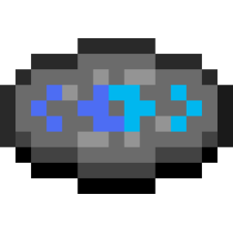
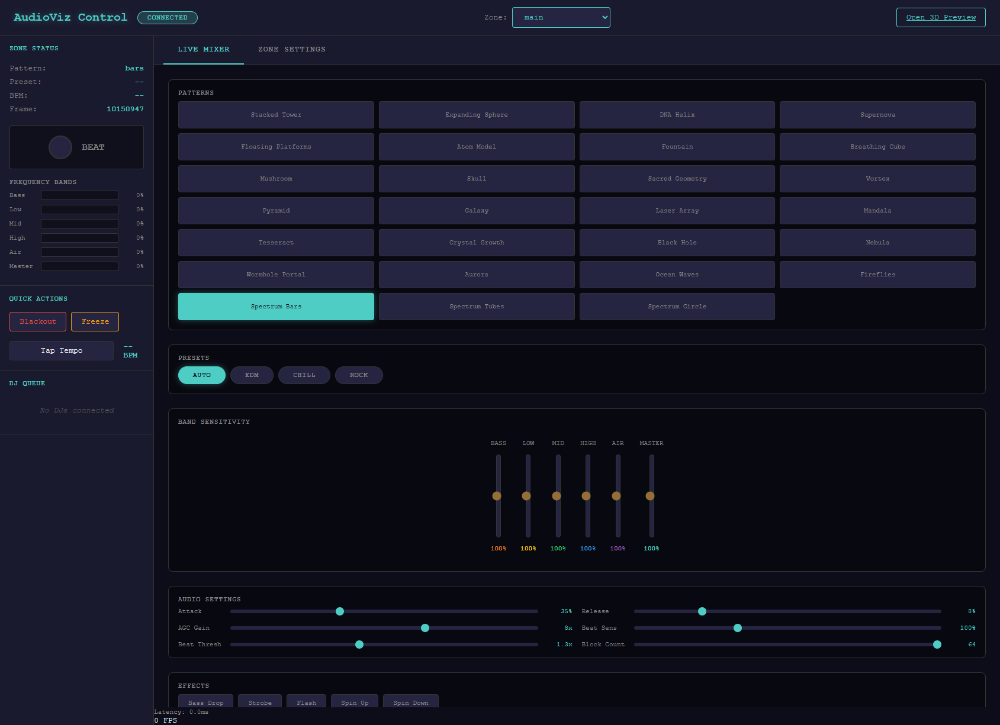
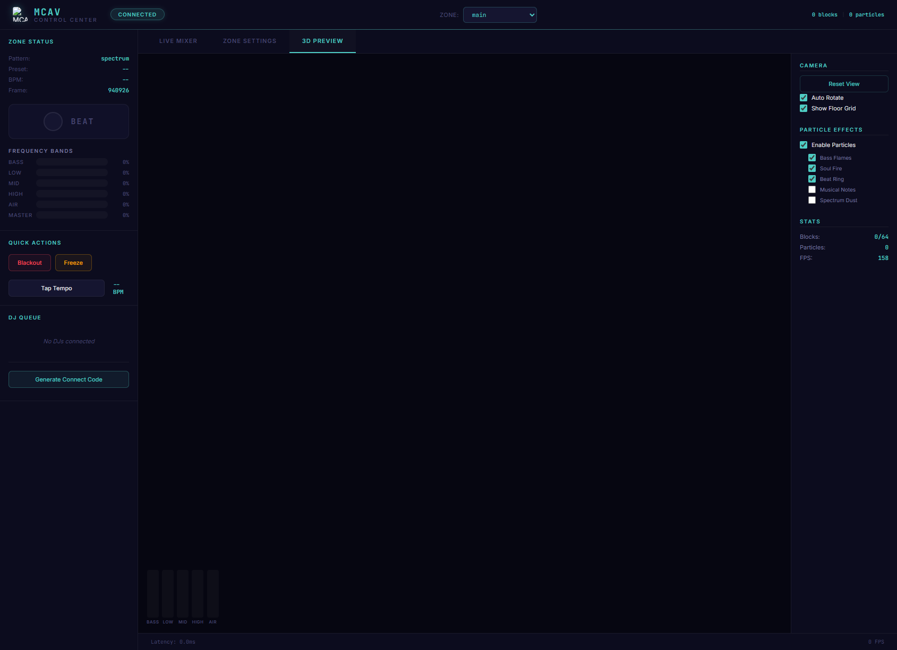
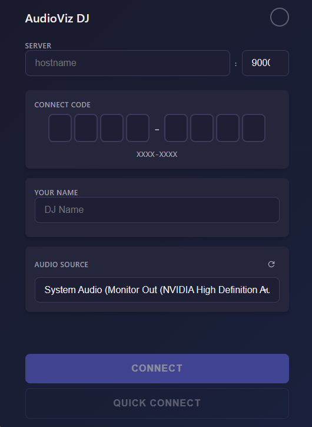
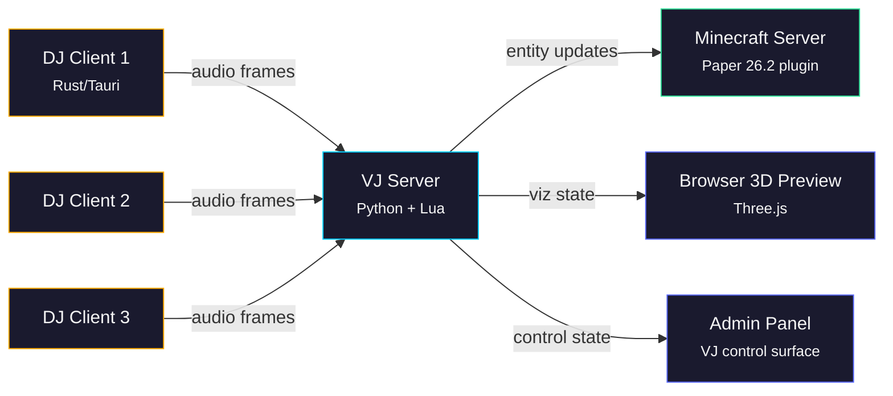
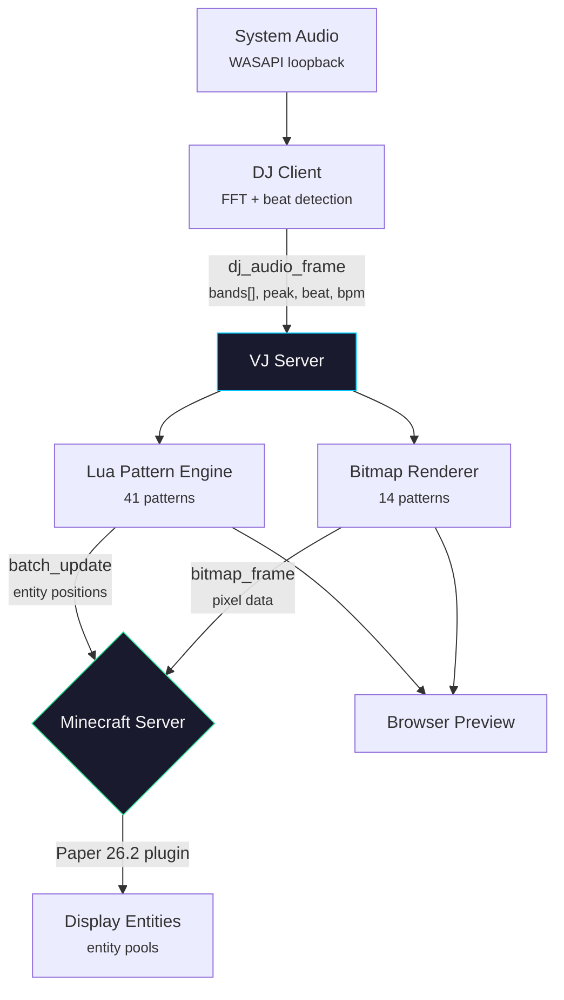
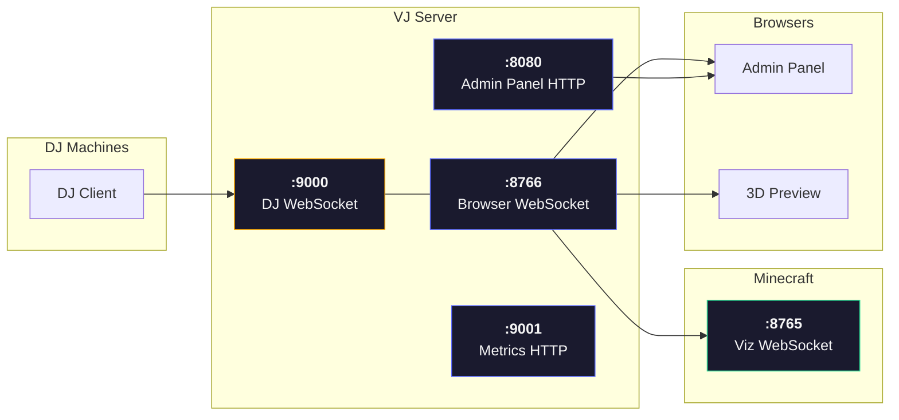
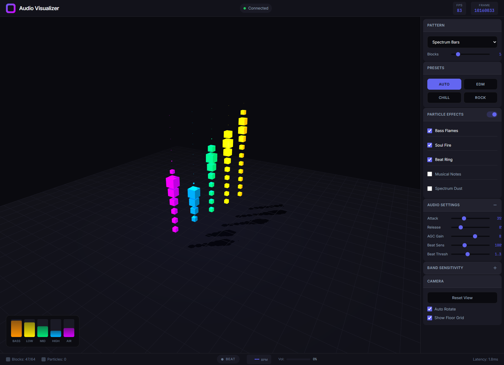
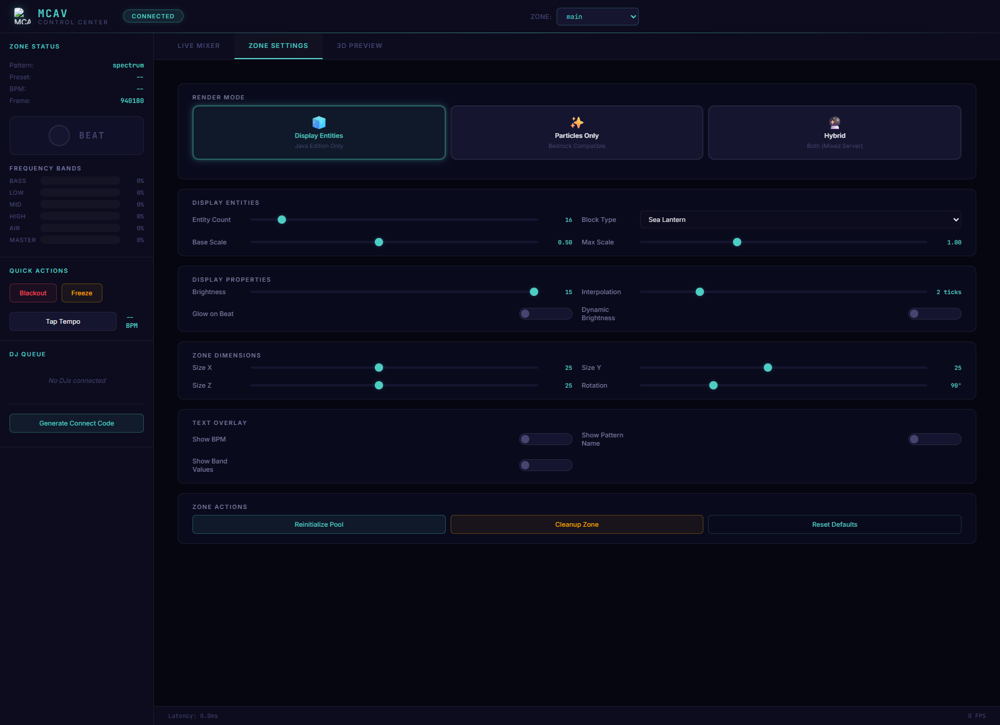

> **Supported Minecraft path:** MCAV 1.1.0 targets Paper 26.2 on Java 25. Follow the [Paper 26.2 installation and rollback guide](docs/PAPER_26_2_INSTALL.md). Prebuilt DJ-client releases, automatic updates, the VJ Docker image, and the zero-install Docker demo remain quarantined.

<div align="center">
  
  <h1>MCAV — Minecraft Audio Visualizer</h1>
  <p><strong>Real-time audio → reactive visuals in Minecraft, browser, and beyond</strong></p>

  [](https://github.com/ryanthemcpherson/minecraft-audio-viz/actions/workflows/ci.yml)
  [](https://github.com/ryanthemcpherson/minecraft-audio-viz/actions/workflows/deploy.yml)
  [](https://github.com/ryanthemcpherson/minecraft-audio-viz/actions/workflows/security.yml)

  
  
  
  
  
  
  
</div>

---

<p align="center">
  
  
  
</p>

---

## Table of Contents

- [Features](#features)
- [Quick Start](#quick-start)
- [Pterodactyl two-port deployment](#pterodactyl-two-port-deployment)
- [Architecture](#architecture)
- [Minecraft Integration](#minecraft-integration)
- [Screenshots & Demo](#screenshots--demo)
- [Visualization Patterns](#visualization-patterns)
- [CLI Reference](#cli-reference)
- [Minecraft Commands](#minecraft-commands)
- [Project Structure](#project-structure)
- [Development](#development)
- [Known Limitations](#known-limitations)
- [Acknowledgments](#acknowledgments)
- [License](#license)

---

## Features

- **Windows Audio Capture** — per-app WASAPI capture (Spotify, Chrome, any audio source)
- **Real-time FFT Analysis** — 5-band frequency processing with ultra-low latency (~20ms)
- **55+ Visualization Patterns** — 41 Lua 3D patterns + 14 bitmap 2D patterns, from Spectrum Bars to Galaxy Spirals, Auroras, Plasma, and more
- **Dual Visualization Modes** — pooled 3D Display Entities and bitmap text-display pixel walls, switchable per zone
- **6 Audio Presets** — auto, edm, chill, rock, hiphop, classical
- **Paper 26.2 Renderer** — supported Java 25 plugin with pooled Display Entities, authenticated loopback transport, and disconnect cleanup
- **Historical Fabric Renderer** — retained as quarantined source; it is not a compatibility claim or release artifact
- **3D Browser Preview** — WebGL scene with full Minecraft rendering parity
- **Admin Control Panel** — VJ-style control surface with live meters, effects, and zone controls
- **DJ Client** — cross-platform Tauri desktop app (Rust) for remote DJ sessions
- **Multi-DJ Support** — multiple remote DJs performing with centralized VJ control
- **Stage System** — multi-zone stages with decorators, spotlight effects, and DJ billboards
- **Timeline System** — pre-program timed shows with pattern, preset, and effect cues
- **Coordinator API** — central DJ coordination with connect codes, show management, and JWT auth
- **Docker source configuration (quarantined)** — retained for unsupported development verification only

---

## Quick Start

### Unsupported Phase 0 development verification

Prebuilt DJ-client installers and the zero-install demo are not supported during Phase 0. Contributors may run local source builds only to verify development changes; they are not release artifacts.

```bash
# Explicitly opt in to the quarantined, incomplete demo configuration
docker compose -f docker-compose.demo.yml --profile phase0-quarantined up

# Or validate an unsigned DJ client source build
cd dj_client
npm ci
npm run test:containment
npm run tauri:build
```

See [`dj_client/README.md`](dj_client/README.md) and [`demo/README.md`](demo/README.md) for the quarantine limitations.

### Pterodactyl two-port deployment

The portable Pterodactyl bundle exposes exactly two public TLS listeners:

| Scope | Port | Transport and purpose |
|-|-|-|
| Public | `8080` | Admin HTTPS, preview HTTPS, and same-origin browser WSS at `/ws` |
| Public | `25808` | DJ WSS with an explicit SHA-256 certificate pin |
| Loopback only | `8765` | Minecraft renderer |
| Loopback only | `9001` | Health and Prometheus metrics |

Extract the RC2 bundle at the server root, set `MCAV_PUBLIC_HOST` in `mcav-vj/mcav.env`, and leave Paper's startup command unchanged. The plugin owns the bundled VJ sidecar. Administrators verify and import the generated certificate; DJs copy its fingerprint from `FIRST_LOGIN.txt`. Plaintext public DJ connections and trust-on-first-use are prohibited. See the complete [Pterodactyl operator guide](docs/deployment/PTERODACTYL.md) for installation, certificate rotation, and failure recovery.

### Paper 26.2 release path

**Requirements:** Paper 26.2 (`26.2.build.112-stable` validated), Java 25+, and the event `mcav-paper-1.2.0-rc.1.jar` with its matching bundled VJ runtime.

Use the [Paper 26.2 operator guide](docs/PAPER_26_2_INSTALL.md) for backup, installation, first-run secret retrieval, loopback pairing, stage creation, diagnostics, disconnect recovery, clean uninstall, and rollback. The guide treats the pairing secret as local-only data and does not expose the renderer listener to the network.

The historical Fabric source and older Minecraft 1.21.x instructions are quarantined. They are not supported alternatives to the Paper 26.2 release path.

---

## Architecture

### System Overview


```mermaid
graph LR
    DJ1[DJ Client 1<br/><small>Rust/Tauri</small>] -->|audio frames| VJ[VJ Server<br/><small>Python + Lua</small>]
    DJ2[DJ Client 2] -->|audio frames| VJ
    DJ3[DJ Client 3] -->|audio frames| VJ

    VJ -->|entity updates| MC[Minecraft Server<br/><small>Paper 26.2 plugin</small>]
    VJ -->|viz state| BP[Browser 3D Preview<br/><small>Three.js</small>]
    VJ -->|control state| AP[Admin Panel<br/><small>VJ control surface</small>]

    style VJ fill:#1a1a2e,stroke:#00ccff,color:#f5f5f5
    style MC fill:#1a1a2e,stroke:#2fe098,color:#f5f5f5
    style DJ1 fill:#1a1a2e,stroke:#ffaa00,color:#f5f5f5
    style DJ2 fill:#1a1a2e,stroke:#ffaa00,color:#f5f5f5
    style DJ3 fill:#1a1a2e,stroke:#ffaa00,color:#f5f5f5
    style BP fill:#1a1a2e,stroke:#5b6aff,color:#f5f5f5
    style AP fill:#1a1a2e,stroke:#5b6aff,color:#f5f5f5
```

### Data Flow


```mermaid
graph TD
    A[System Audio<br/><small>WASAPI loopback</small>] --> B[DJ Client<br/><small>FFT + beat detection</small>]
    B -->|"dj_audio_frame<br/><small>bands[], peak, beat, bpm</small>"| C[VJ Server]
    C --> D[Lua Pattern Engine<br/><small>41 patterns</small>]
    C --> E[Bitmap Renderer<br/><small>14 patterns</small>]
    D -->|"batch_update<br/><small>entity positions</small>"| F{Minecraft Server}
    E -->|"bitmap_frame<br/><small>pixel data</small>"| F
    D --> G[Browser Preview]
    E --> G

    F -->|Paper 26.2 plugin| J[Display Entities<br/><small>entity pools</small>]

    style C fill:#1a1a2e,stroke:#00ccff,color:#f5f5f5
    style F fill:#1a1a2e,stroke:#2fe098,color:#f5f5f5
```

### Development and legacy network ports

The following diagram and table describe the configurable source-development defaults. They are not the Pterodactyl public topology; the packaged deployment uses only `8080` and `25808` publicly as described above.


```mermaid
graph LR
    subgraph DJ Machines
        DJC[DJ Client]
    end

    subgraph VJ Server
        DJ_PORT["<b>:9000</b><br/>DJ WebSocket"]
        BR_PORT["<b>:8766</b><br/>Browser WebSocket"]
        HTTP_PORT["<b>:8080</b><br/>Admin Panel HTTP"]
        MET_PORT["<b>:9001</b><br/>Metrics HTTP"]
    end

    subgraph Minecraft
        MC_PORT["<b>:8765</b><br/>Viz WebSocket"]
    end

    subgraph Browsers
        ADMIN[Admin Panel]
        PREVIEW[3D Preview]
    end

    DJC --> DJ_PORT
    DJ_PORT --- BR_PORT
    BR_PORT --> MC_PORT
    BR_PORT --> ADMIN
    BR_PORT --> PREVIEW
    HTTP_PORT --> ADMIN

    style DJ_PORT fill:#1a1a2e,stroke:#ffaa00,color:#f5f5f5
    style BR_PORT fill:#1a1a2e,stroke:#5b6aff,color:#f5f5f5
    style MC_PORT fill:#1a1a2e,stroke:#2fe098,color:#f5f5f5
    style HTTP_PORT fill:#1a1a2e,stroke:#5b6aff,color:#f5f5f5
    style MET_PORT fill:#1a1a2e,stroke:#5b6aff,color:#f5f5f5
```

| Port | Protocol | Purpose |
|-|-|-|
| 8765 | WebSocket | Minecraft mod/plugin ↔ VJ server |
| 8766 | WebSocket | Browser clients (3D preview, admin panel) |
| 9000 | WebSocket | DJ clients → VJ server |
| 8080 | HTTP | Admin panel + 3D preview web UI |
| 9001 | HTTP | Prometheus-compatible metrics (optional) |

---

## Minecraft Integration

The supported release renderer is the Paper 26.2 plugin in `minecraft_plugin/`. It runs on Java 25, receives authenticated VJ messages over a loopback-only WebSocket listener, and renders pooled Display Entities.

### Paper 26.2 capabilities

- **Zone management** — create, position, resize, rotate, and persist visualization zones
- **Pattern switching** — Lua 3D patterns and bitmap patterns from the shared VJ server
- **Beat-reactive effects** — particle bursts, ambient lighting, and stage decorators
- **Stage system** — multi-zone stage templates, placement, activation, and persistence
- **Inventory menus** — in-game zone, stage, pattern, and performance controls
- **Bounded processing** — parser and tick queues expose overload and latency diagnostics
- **Safe disconnects** — a configurable grace window permits reconnect, then removes active entities without deleting saved stage data
- **Optional Bedrock access** — Geyser/Floodgate integration can be validated separately

### Historical Fabric source

`minecraft_mod/` is retained as quarantined historical source from the Minecraft 1.21.x line. It is not built, published, or supported by the Paper 26.2 release and should not be used as an installation alternative.

---

## Screenshots & Demo

### Admin Control Panel


### 3D Browser Preview


### Zone Management


**Demo Video:** [Watch on YouTube](https://www.youtube.com/watch?v=zH30YXrc2uw)

---

## Visualization Patterns

### Lua 3D Patterns (41)

3D entity-based patterns computed by the VJ server's Lua engine. The supported Paper 26.2 plugin renders them with pooled Display Entities, and the browser 3D preview mirrors them. The old Fabric renderer is historical and quarantined.

| Pattern | Key | Description |
|-|-|-|
| Spectrum Bars | `bars` | Classic frequency bar display |
| Stacked Tower | `spectrum` | Vertical stacking bars |
| Spectrum Tubes | `tubes` | 3D tube-based spectrum analyzer |
| Spectrum Circle | `circle` | Circular spectrum layout |
| DNA Helix | `wave` | Double helix rotating structure |
| Atom Model | `orbit` | Orbital electron visualization |
| Expanding Sphere | `ring` | Pulsing sphere that expands with bass |
| Floating Platforms | `columns` | Suspended platforms responding to audio |
| Fountain | `matrix` | Particle fountain effect |
| Breathing Cube | `heartbeat` | Cube that expands/contracts with music |
| Mushroom | `mushroom` | Organic mushroom-shaped visualization |
| Skull | `skull` | Beat-reactive skull pattern |
| Sacred Geometry | `sacred` | Mathematical sacred geometry patterns |
| Vortex | `vortex` | Spinning vortex tunnel |
| Pyramid | `pyramid` | Egyptian pyramid with audio response |
| Galaxy Spiral | `galaxy` | Spiral galaxy visualization |
| Laser Array | `laser` | Concert-style laser beam array |
| Supernova | `explode` | Explosive supernova effect |
| Mandala | `mandala` | Symmetrical mandala visualization |
| Tesseract | `tesseract` | 4D hypercube projection |
| Crystal Growth | `crystal` | Growing crystal structure |
| Black Hole | `blackhole` | Gravitational lensing effect |
| Nebula | `nebula` | Space nebula cloud |
| Wormhole Portal | `wormhole` | Wormhole tunnel visualization |
| Aurora | `aurora` | Northern lights effect |
| Ocean Waves | `ocean` | Ocean wave simulation |
| Fireflies | `fireflies` | Swarm of glowing fireflies |
| Laser Fan | `laserfan` | Scanning laser fan array |
| Moving Heads | `movingheads` | Concert moving head lights |
| Pyrotechnics | `pyro` | Stage pyro flame effects |
| Shockwave | `shockwave` | Expanding shockwave rings |
| Crown | `crown` | Rotating crown structure |
| Dragon | `dragon` | Beat-reactive dragon form |
| Phoenix | `phoenix` | Rising phoenix visualization |
| Fist | `fist` | Pumping fist animation |
| Sword | `sword` | Glowing sword visualization |
| LED Wall | `ledwall` | Flat LED grid rendering |
| Drop Sequence | `dropsequence` | Build-up and drop animation |
| BPM Pulse | `bpm_pulse` | BPM-synced pulsing effect |
| BPM Strobe | `bpm_strobe` | BPM-synced strobe effect |
| Strobe | `strobe` | Classic strobe effect |

### Bitmap Patterns (14)

Flat 2D pixel-grid patterns. The supported Paper 26.2 plugin renders them as individually addressable text-display pixels with effects processing and layer compositing. The former Fabric map-tile implementation is historical and quarantined.

| Pattern | Key | Description |
|-|-|-|
| Spectrum Bars | `bmp_spectrum_bars` | Classic LED bar graph with color mapping |
| Spectrogram | `bmp_spectrogram` | Scrolling frequency x time heat map |
| Plasma | `bmp_plasma` | Audio-reactive plasma shader |
| Circular Spectrum | `bmp_circular` | Radial spectrum analyzer |
| Fire | `bmp_fire` | Fluid fire simulation |
| Matrix Rain | `bmp_matrix_rain` | Digital rain cascade |
| Starfield | `bmp_starfield` | Warp-speed starfield |
| Concentric Rings | `bmp_rings` | Expanding ring visualization |
| Aurora | `bmp_aurora` | Northern lights effect |
| Tunnel Zoom | `bmp_tunnel` | Infinite tunnel zoom |
| Kaleidoscope | `bmp_kaleidoscope` | Symmetrical kaleidoscope effect |
| Galaxy | `bmp_galaxy` | Spiral galaxy with star particles |
| Lightning | `bmp_lightning` | Beat-triggered lightning bolts |
| Rotating Geometry | `bmp_geometry` | Rotating 3D wireframes |

---

## CLI Reference

### VJ Server Commands

```bash
# Export the generated Paper pairing secret first; do not put it in shell history.
audioviz-vj --minecraft-host 127.0.0.1 --minecraft-port 8765  # same-host Paper
audioviz-vj --port 9000                   # custom DJ port
audioviz-vj --minecraft-host 127.0.0.1 --minecraft-port 18765  # encrypted tunnel
audioviz-vj --no-auth                     # dev mode - skip authentication
audioviz-vj --metrics-port 9001           # health metrics endpoint
```

### DJ Client

The DJ Client is a desktop GUI app. Prebuilt distribution is quarantined during Phase 0. For unsigned development verification, see `dj_client/README.md`.

---

## Minecraft Commands

The Paper 26.2 plugin uses the `/audioviz` command tree below. The historical Fabric implementation is quarantined and is not covered by this command reference.

| Command | Description |
|-|-|
| `/audioviz menu` | Open the main control panel (`/av menu`, `/mcav menu`) |
| `/audioviz zone create <name>` | Create a new visualization zone |
| `/audioviz zone delete <name>` | Delete a zone |
| `/audioviz zone list` | List all zones |
| `/audioviz zone setsize <name> <x> <y> <z>` | Set zone dimensions |
| `/audioviz zone setrotation <name> <degrees>` | Set zone rotation |
| `/audioviz zone info <name>` | Show zone details |
| `/audioviz test <zone> <wave\|pulse\|random>` | Run test animation |
| `/audioviz status` | Show connection and system status |
| `/audioviz help` | Show command help |

---

<details>
<summary><strong>Multi-DJ Mode (Development Reference)</strong></summary>

### 1) Start the VJ Server (central control)

```bash
audioviz-vj
```

Defaults:
- DJ connection port: `ws://localhost:9000`
- Browser preview: `http://localhost:8080`
- Admin panel: `http://localhost:8080`

### 2) DJs connect using a development DJ Client (each DJ machine)

1. Build the unsigned DJ Client from source for development verification only
2. Launch the DJ Client
3. Enter VJ server connection details (host, port, DJ name, connect code)
4. Select audio source and start streaming

### 3) Optional: DJ authentication (recommended)

The VJ server supports connect-code authentication for multi-DJ sessions. Configure DJ credentials in `vj_server/config.py` or use environment variables.

For production, the VJ server enforces authentication by default.

</details>

<details>
<summary><strong>Paper 26.2 in-game features</strong></summary>

### GUI menu system
- Main menu (system status, active zones, connection info)
- DJ control panel (effects, presets, zone selection)
- Stage management (create/edit stages, assign zone roles)
- VJ control panel (pattern selection, intensity slider, render mode toggle)
- Zone management + zone editor (size/rotation/placement)
- Stage decorator menus (spotlights, DJ banners, floor tiles)
- Settings menu (performance tuning)

### Beat effects
- Particle bursts on beats (bass flame, beat ring, spectrum dust, ambient mist)
- Beat event system with configurable thresholds
- Ambient lighting that responds to audio state
- Stage decorators (spotlights, DJ billboards, floor tiles, beat text FX)

### Render backends

- Display entity pools — pre-allocated real entities with interpolation
- Text display pixel grid — individually-addressable pixels via text display background color
- Async bitmap rendering on dedicated thread pool

The former Fabric map renderer, Polymer virtual entities, and bundle packet path are historical/quarantined and not part of this release.

</details>

<details>
<summary><strong>Timeline System</strong></summary>

Pre-program visualization shows:
- **Tracks:** Patterns, Presets, Effects, Parameters
- **Cues:** timed events that trigger actions
- **Triggers:** time-based, beat-synced, or manual
- **Transport:** play/pause/stop/seek

</details>

<details>
<summary><strong>Unsupported Docker source verification (Phase 0 quarantine)</strong></summary>

The VJ Docker image is not published or supported during Phase 0. Contributors can explicitly opt in to the quarantined source configuration for development verification:

```bash
docker compose --profile phase0-quarantined up -d vj-server
docker compose logs -f vj-server
```

> This command is not a deployment recommendation or an end-to-end acceptance path. Audio capture still requires a local DJ client.

</details>

---

## Project Structure

```text
minecraft-audio-viz/
├── dj_client/             # DJ Client (Rust/Tauri, audio capture + FFT)
├── vj_server/             # VJ Server (Python, Lua pattern engine + routing)
├── minecraft_mod/         # Historical/quarantined Fabric source (MC 1.21.x line)
├── minecraft_plugin/      # Supported Paper 26.2 plugin (Java 25)
├── admin_panel/           # Web control panel (VJ interface)
├── preview_tool/          # 3D browser preview (Three.js)
├── site/                  # Landing page (Next.js 15, mcav.live)
├── coordinator/           # DJ coordinator API (FastAPI, PostgreSQL)
├── community_bot/         # Discord community bot (discord.py)
├── discord_bot/           # Discord voice audio capture bot
├── worker/                # Tenant router (Cloudflare Workers)
├── protocol/              # Shared WebSocket protocol schemas
├── patterns/              # Lua 3D visualization patterns (41)
├── configs/               # Configuration files
├── docs/                  # Architecture and ops docs
├── scripts/               # PowerShell quick-start scripts
├── shows/                 # Saved show files
└── archive/               # Archived components
    └── python_dj_cli/     # Old Python DJ CLI (deprecated)
```

### Web Platform (mcav.live)

| Component | Path | Stack | Purpose |
|-|-|-|-|
| Landing Site | `site/` | Next.js 15, Tailwind CSS 4, Three.js | Product page, pattern gallery, getting started |
| Coordinator | `coordinator/` | FastAPI, SQLAlchemy, PostgreSQL | DJ connect codes, show management, JWT auth |
| Tenant Router | `worker/` | Cloudflare Workers, TypeScript | Multi-tenant subdomain routing |

---

## Development

```bash
# VJ Server
cd vj_server && pip install -e ".[dev]" && pytest

# Historical Fabric source (quarantined; not a release acceptance path)
cd minecraft_mod && ./gradlew build

# Minecraft Plugin (Paper 26.2, Java 25)
cd minecraft_plugin && mvn package

# DJ Client (Rust/Tauri)
cd dj_client && npm install && npm run tauri dev

# Coordinator API
cd coordinator && pip install -e ".[dev]" && pytest

# Site (Next.js)
cd site && npm install && npm run dev
```

---

## Known Limitations

- **Windows-only audio capture** — WASAPI is required for per-application audio capture. The VJ server source can run on Linux, but its Docker path is quarantined during Phase 0 and DJs must run locally.
- **Exact supported renderer boundary** — the public plugin path is Paper 26.2 on Java 25; Spigot, Purpur, other forks, Minecraft 1.21.x, Java 21, and the historical Fabric source are outside this release's compatibility claim.
- **Low-frequency resolution limited** — 1024-sample FFT at 48kHz cannot accurately detect frequencies below ~43Hz, so sub-bass (20-40Hz) is excluded from the 5-band system.

---

## Acknowledgments

The **Bitmap LED Wall** rendering system was inspired by [TheCymaera's Minecraft Text Display Experiments](https://github.com/TheCymaera/minecraft-text-display-experiments) ([video](https://youtu.be/uZmEYYs0ZKs)). TheCymaera pioneered the technique of using text display entities as individually-addressable pixels — setting `text` to a space character and manipulating the `background` ARGB value to create flat pixel grids, bitmap displays, and interactive paint canvases within Minecraft. MCAV adapted this approach for real-time audio-reactive visualization, adding a frame buffer pipeline, VJ control protocol, transition engine, and effects processing on top of the core pixel-grid concept.

---

## License

MIT — see [LICENSE](LICENSE)
