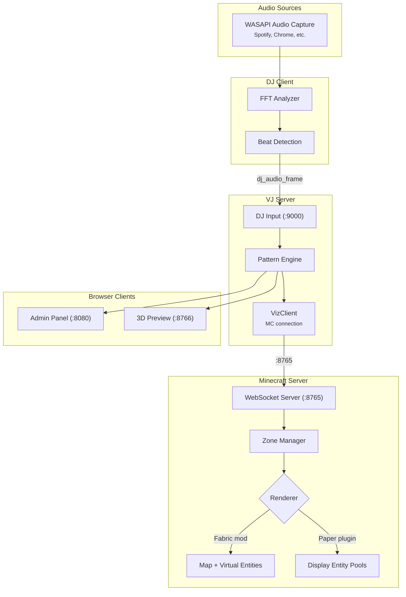

# WebSocket Connectivity Architecture

This document describes the WebSocket connectivity architecture for the Minecraft Audio Visualizer system, including deployment profiles, ports, reconnection behavior, heartbeat mechanisms, and troubleshooting guidance.

## Architecture Overview

The system uses a three-tier distributed architecture with WebSocket connections. This first diagram shows the configurable source-development defaults; the packaged Pterodactyl profile is the two-port TLS topology documented below.



## Port Reference

### Development and legacy defaults

These defaults remain available for local/source development. They are not instructions for public exposure.

| Port | Protocol | Component | Description |
|-|-|-|-|
| **8765** | WebSocket | Minecraft (mod or plugin) | Primary visualization data channel. Receives batch entity updates, audio data, and zone commands. |
| **8766** | WebSocket | VJ Server → Browsers | Browser client broadcast. Sends visualization state to 3D preview and admin panel. |
| **9000** | WebSocket | VJ Server ← DJs | Remote DJ connections. Receives audio frames from remote DJs for centralized mixing. |
| **8080** | HTTP | VJ Server | Admin panel web interface. Serves static files for DJ control panel. |
| **9001** | HTTP | VJ Server | Optional health and Prometheus metrics endpoint. |

### Pterodactyl two-port release

The portable Pterodactyl deployment uses this fixed topology:

| Exposure | Port | Transport | Purpose |
|-|-|-|-|
| Public | **8080** | HTTPS and WSS | Admin and preview assets plus authenticated same-origin browser WebSocket at `/ws` |
| Public | **25808** | WSS | Authenticated remote DJ input with certificate pinning |
| Loopback only | **8765** | WebSocket | Minecraft renderer control/data |
| Loopback only | **9001** | HTTP | Health and Prometheus metrics |

Unified mode does not start the separate browser listener on `8766`. The Pterodactyl wrapper requires `HTTP_PORT=8080`, `VJ_SERVER_PORT=25808`, `UNIFIED_WEB=true`, no `BROADCAST_PORT`, and `MCAV_PUBLIC_HOST=<public-ip>`. Global source-development defaults remain unchanged.

One generated certificate, with the configured public IP in its subject alternative names, secures both public listeners. An administrator downloads `state/tls.crt`, verifies it against `TLS_SHA256_FINGERPRINT` in `FIRST_LOGIN.txt`, and imports it into the administrator machine's trust store. Each DJ copies the same fingerprint into the **Server certificate SHA-256 fingerprint** profile field before connecting to `DJ_ENDPOINT`.

The native client verifies the pin before sending credentials, connection codes, palette data, or audio. There is no plaintext downgrade, trust-on-first-use path, or accept-anyway control. When the public IP or certificate changes, run the explicit `--rotate-tls-identity` procedure, replace the administrator trust entry, and update every DJ pin before reconnecting. See the [Pterodactyl operator guide](deployment/PTERODACTYL.md) for the exact command and recovery steps.

## Secure Renderer Transport

The Minecraft renderer listener on port 8765 is a native control endpoint and accepts explicit loopback binds only. Paper, Fabric, and the Python `VizClient` all reject direct LAN, wildcard, hostname, and public renderer targets. A shared secret authenticates the client but does not make plaintext `ws://` safe outside the host.

When the VJ server runs on the Minecraft host, keep the defaults:

```bash
audioviz-vj
```

For split-host deployments, establish an encrypted tunnel from the VJ host to the Minecraft host's loopback listener. This SSH example reserves local port 18765 on the VJ host:

```bash
# Terminal 1 on the VJ host
ssh -N -L 18765:127.0.0.1:8765 operator@minecraft-host

# Terminal 2 on the VJ host
audioviz-vj --minecraft-host 127.0.0.1 --minecraft-port 18765
```

Keep the tunnel process supervised for production use and restrict SSH credentials to the minimum required access. Do not expose or port-forward 8765 directly.

## Reconnection Behavior

All WebSocket connections implement exponential backoff with jitter to prevent thundering herd problems.

### DJ Relay (Remote DJ → VJ Server)

The `DJRelay` class handles connections from remote DJs to the central VJ server.

| Parameter | Value | Description |
|-----------|-------|-------------|
| Initial backoff | `reconnect_interval` (default: 5s) | Starting delay between reconnection attempts |
| Backoff multiplier | 1.5x | Each failure multiplies the delay |
| Maximum backoff | 30s | Delay is capped at this value |
| Jitter | ±10% | Random variation to prevent synchronized reconnects |
| Max connect attempts | `max_connect_attempts` (default: 3) | Initial connection retries before failure |

**Behavior:**
- On initial connection: Retries up to `max_connect_attempts` times with exponential backoff
- On connection loss: Automatically reconnects with exponential backoff (resets on success)
- On auth failure: Does NOT retry (credentials are wrong)

### VJ Server → Minecraft

The `VJServer._minecraft_reconnect_loop()` monitors and reconnects to Minecraft.

| Parameter | Value | Description |
|-----------|-------|-------------|
| Check interval | 5s | How often connection health is checked |
| Initial backoff | 5s | Starting delay after disconnect detected |
| Backoff multiplier | 1.5x | Each failure multiplies the delay |
| Maximum backoff | 60s | Delay is capped at this value |

**Behavior:**
- Runs continuously in background
- Detects disconnect via `VizClient.connected` property
- Attempts reconnection with exponential backoff
- Resets backoff to initial value on successful reconnection
- Logs health metrics every 60 seconds

### Admin Panel (Browser → VJ Server)

The admin panel JavaScript (`WebSocketService.js`) implements reconnection for browser clients.

| Parameter | Value | Description |
|-----------|-------|-------------|
| Initial backoff | 2s | Starting delay (configurable via `reconnectInterval`) |
| Backoff multiplier | 1.5x | Each failure multiplies the delay |
| Maximum backoff | 30s | Delay is capped at this value |
| Max attempts | 10 | Total reconnection attempts before giving up (configurable via `maxReconnectAttempts`) |
| Ping interval | 5s | How often client pings the server |
| Pong timeout | 20s | Time without pong before reconnecting |
| Message queue size | 500 | Max queued messages while disconnected (FIFO eviction) |

**Behavior:**
- Shows connection status indicator in UI
- Automatically reconnects on WebSocket close
- Displays "Connecting..." status during reconnection
- After 10 failed attempts, emits `reconnect_failed` event
- Queues up to 500 messages while disconnected (oldest evicted first)
- Flushes message queue on reconnection
- Resets backoff counter on first successful message (not just connection open)

### Python VizClient

The `VizClient` class provides optional auto-reconnection.

| Parameter | Value | Description |
|-----------|-------|-------------|
| Connect timeout | `connect_timeout` (default: 10s) | Timeout for initial connection |
| Auto-reconnect | `auto_reconnect` (default: False) | Enable automatic reconnection |
| Initial backoff | 1s | Starting delay |
| Backoff multiplier | 1.5x | Each failure multiplies the delay |
| Maximum backoff | 30s | Delay is capped at this value |
| Max attempts | `max_reconnect_attempts` (default: 10) | Total reconnection attempts |

**Behavior:**
- Connection timeout prevents hanging on unreachable hosts
- Auto-reconnect is opt-in (disabled by default for scripting use)
- Reconnection counter resets on successful connection

## Heartbeat Mechanisms

Heartbeats detect dead connections that TCP keep-alive might miss.

### DJ → VJ Server Heartbeat

| Parameter | Value | Description |
|-----------|-------|-------------|
| Interval | `heartbeat_interval` (default: 2s) | How often heartbeats are sent |
| Failure threshold | 3 | Consecutive failures before disconnect |

**Protocol:**
```json
// DJ sends:
{"type": "dj_heartbeat", "ts": 1706889600.123, "mc_connected": true}

// VJ Server responds:
{"type": "heartbeat_ack", "server_time": 1706889600.125}
```

**Behavior:**
- DJ sends heartbeat every 2 seconds
- 3 consecutive send failures trigger disconnect callback
- Counter resets on successful send
- In direct mode, includes Minecraft connection status

### VizClient ↔ Minecraft Heartbeat

| Parameter | Value | Description |
|-----------|-------|-------------|
| Ping interval | 10s | How often pings are sent |
| Pong timeout | 30s | Time without pong before disconnect |

**Protocol:**
```json
// Client sends:
{"type": "ping"}

// Server responds:
{"type": "pong"}
```

**Behavior:**
- Client sends ping every 10 seconds
- If no pong received for 30+ seconds, triggers disconnect
- Auto-reconnect (if enabled) kicks in after disconnect

### VJ Server → Browser Heartbeat

| Parameter | Value | Description |
|-----------|-------|-------------|
| Ping interval | 15s | How often server pings browsers |
| Missed pong threshold | 2 | Pongs missed before client removal |

**Behavior:**
- Server sends ping to all browser clients every 15 seconds
- Tracks last pong time per client
- Removes clients that miss 2 consecutive pongs
- Cleans up tracking data when client disconnects

## Message Queue Behavior

### Minecraft Message Queue

Both the Fabric mod and Paper plugin use a tick-based message queue.

| Parameter | Default | Description |
|-----------|---------|-------------|
| Queue size | 1000 | Maximum pending messages |
| Processing | Per-tick | All messages processed each server tick |

**Overflow behavior:**
- When queue is full, oldest messages are dropped
- Logs warning when queue nears capacity
- Designed to prevent memory exhaustion under load

### Python Async Queues

Python components use `asyncio.Queue` with sensible defaults.

**Overflow behavior:**
- Unbounded queues (backpressure handled by WebSocket protocol)
- WebSocket library handles TCP flow control automatically

## Configuration Options

### DJRelayConfig

```python
from audio_processor.dj_relay import DJRelayConfig

config = DJRelayConfig(
    vj_server_url="ws://127.0.0.1:9000",  # Local development only
    dj_id="dj_alice",
    dj_name="DJ Alice",
    dj_key="secret_key",
    reconnect_interval=5.0,    # Initial backoff (seconds)
    heartbeat_interval=2.0,    # Heartbeat frequency (seconds)
    max_connect_attempts=3,    # Initial connection retries
    direct_mode=False,         # Direct Minecraft connection
    minecraft_host=None,       # None = get from VJ server
    minecraft_port=8765,
    zone="main",
    entity_count=16
)
```

### VizClient

```python
from vj_server.viz_client import VizClient

client = VizClient(
    host="127.0.0.1",          # Same host or local encrypted-tunnel endpoint only
    port=8765,                 # Use the tunnel's local port for split-host deployments
    connect_timeout=10.0,      # Connection timeout (seconds)
    auto_reconnect=False,      # Enable auto-reconnection
    max_reconnect_attempts=10  # Reconnection attempts
)
```

## Network Condition Tuning

### LAN Deployment (Low Latency)

For local network setups with reliable connectivity:

```python
# DJ Relay - aggressive reconnection
config = DJRelayConfig(
    reconnect_interval=2.0,      # Short initial backoff
    heartbeat_interval=1.0,      # Frequent heartbeats
    max_connect_attempts=5       # More retries
)

# VizClient - fast timeout
client = VizClient(
    connect_timeout=5.0,         # Short timeout
    auto_reconnect=True
)
```

### WAN Deployment (High Latency)

For internet deployments with variable latency:

```python
# DJ Relay - patient reconnection
config = DJRelayConfig(
    reconnect_interval=10.0,     # Longer initial backoff
    heartbeat_interval=5.0,      # Less frequent heartbeats
    max_connect_attempts=3       # Fewer retries (save bandwidth)
)

# VizClient - generous timeout
client = VizClient(
    connect_timeout=30.0,        # Long timeout for slow connections
    auto_reconnect=True,
    max_reconnect_attempts=15    # More attempts for flaky connections
)
```

## Troubleshooting

### Connection Refused

**Symptoms:** `ConnectionRefusedError` or "Connection refused" in logs

**Causes:**
1. Target service not running
2. Firewall blocking port
3. Wrong host/port configuration

**Solutions:**
1. Verify service is running: `netstat -an | grep <port>`
2. Check firewall rules
3. Verify configuration matches service settings

### Connection Timeout

**Symptoms:** Connection hangs then fails after timeout

**Causes:**
1. Network routing issues
2. Host unreachable
3. Port blocked by firewall (no reject, just drop)

**Solutions:**
1. Ping the host to verify reachability
2. Check intermediate firewalls
3. Increase `connect_timeout` for slow networks

### Heartbeat Timeout

**Symptoms:** "Pong timeout" or "Heartbeat failures exceeded" in logs

**Causes:**
1. Network congestion causing packet loss
2. Server overloaded (not responding in time)
3. Half-open connection (one side thinks it's connected)

**Solutions:**
1. Check server load and performance
2. Increase heartbeat intervals for busy networks
3. Check for network quality issues (packet loss, high latency)

### Message Queue Overflow

**Symptoms:** "Queue full" warnings, dropped messages

**Causes:**
1. Processing too slow for incoming rate
2. Burst of messages exceeding capacity
3. Server tick rate too slow

**Solutions:**
1. Reduce message frequency (lower FPS)
2. Increase queue size (if memory allows)
3. Check for processing bottlenecks

### Frequent Reconnections

**Symptoms:** Connection established then quickly lost, repeated reconnection attempts

**Causes:**
1. Server rejecting connections (auth failure, duplicate ID)
2. Unstable network
3. Server crashing/restarting

**Solutions:**
1. Check server logs for rejection reasons
2. Verify authentication credentials
3. Monitor server stability

## Health Monitoring

The VJ Server provides health statistics via `get_health_stats()`:

```json
{
    "dj_connects": 15,
    "dj_disconnects": 12,
    "browser_connects": 45,
    "browser_disconnects": 42,
    "mc_reconnect_count": 2,
    "current_djs": 3,
    "current_browsers": 3,
    "mc_connected": true
}
```

These metrics are logged every 60 seconds and can be monitored for:
- Connection stability (disconnect/connect ratio)
- Client churn (frequent reconnections)
- Minecraft connectivity health
